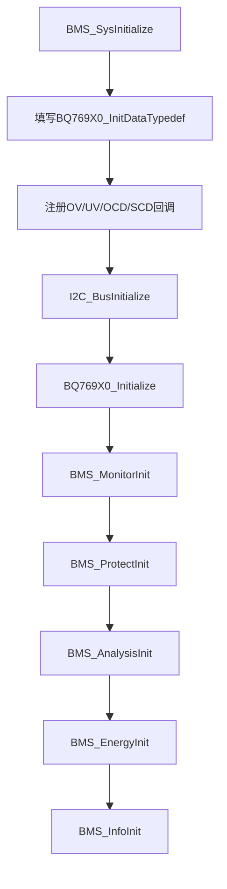
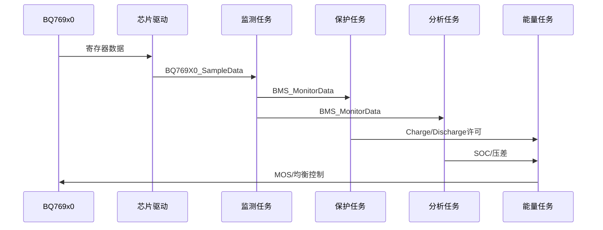

# BMS 项目初学者完整教程

## 先建立三个概念

### MCU 是什么

STM32F103C8T6 是一颗微控制器。它负责执行 C 代码、读 GPIO 电平、产生时钟、收发 UART/CAN，并通过中断响应硬件事件。它本身不会自动理解“电池过压”，必须由程序读取测量值后判断。

### RTOS 是什么

FreeRTOS 是任务调度器。项目把不同工作拆成多个任务，例如监测任务负责采样，保护任务负责判断风险，能量任务负责控制 MOS。调度器根据优先级和阻塞状态轮流执行这些任务。

### BMS 是什么

BMS 不是一个单独芯片，而是一套“测量、判断、执行、通信”的系统：


## 工程从哪里开始

### `startup_stm32f103xb.s`

这是复位后的第一段代码，不是普通 C 文件。它建立主堆栈、复制中断向量表，并跳转到 `SystemInit()` 和 `main()`。你通常不修改它，但移植 MCU 型号时必须确认启动文件型号匹配。

### `Core/Src/main.c`

这是 C 语言主入口。执行顺序如下：

```c
HAL_Init();
SystemClock_Config();
MX_GPIO_Init();
MX_USART1_UART_Init();
MX_USART2_UART_Init();
MX_CAN_Init();
osKernelInitialize();
MX_FREERTOS_Init();
osKernelStart();
```

每一行的意义：

|函数|作用|
|---|---|
|`HAL_Init`|初始化 HAL、SysTick 和底层中断优先级|
|`SystemClock_Config`|使用 HSE/PLL 配置 CPU、AHB、APB 时钟|
|`MX_GPIO_Init`|配置 LED、MOS、模拟 I²C 等 GPIO|
|`MX_USARTx_UART_Init`|配置串口波特率、数据位和收发模式|
|`MX_CAN_Init`|配置 CAN 波特率和基本参数|
|`osKernelInitialize`|初始化 RTOS 内核对象|
|`MX_FREERTOS_Init`|创建启动任务|
|`osKernelStart`|启动调度器，之后由任务运行|

`main()` 不直接完成 BMS 采样。这样做的原因是采样、保护和通信都需要周期运行，适合交给 RTOS 任务管理。

### `Core/Src/freertos.c`

这里定义 `defaultTask`。`StartDefaultTask()` 中调用 `BMS_SysInitialize()`，然后每 500 ms 翻转 LED。LED 只能证明启动任务仍在运行，不能证明 BMS 采样和保护完全正常。

## `User/Bms/bms_app.c`：业务总装配图

`BMS_SysInitialize()` 是项目自定义的总入口，类似汽车装配线：先准备总线，再启动芯片，最后创建业务模块。



关键数据是 `BQ769X0_InitDataTypedef InitData`。其中 `AlertOps` 保存故障回调函数地址，`ConfigData` 保存保护延时和阈值。C 语言中把函数名作为参数传入，叫函数指针；芯片发生告警时，驱动通过函数指针回调保护模块。

## 项目分层：为什么要分这么多文件

```text
应用编排层       bms_app.c
业务逻辑层       bms_monitor/protect/analysis/energy/info.c
硬件抽象层       bms_hal_monitor/control/config.c
芯片驱动层       drv_softi2c_bq769x0.c
总线时序层       drv_soft_i2c.c
STM32基础层      Core/Src、HAL
RTOS层           FreeRTOS、CMSIS-RTOS2
```

分层的核心思想是：上层只表达“关闭放电”，下层再决定是拉低 GPIO、写 BQ 寄存器还是控制外部驱动芯片。这样更换 PCB 或 MOS 有效电平时，不需要重写保护算法。

## `User/Drivers`：怎样读懂和移植驱动

### `drv_soft_i2c.c/.h`

这是 GPIO 模拟 I²C，不使用 STM32 硬件 I²C 外设。典型流程是：

```text
SDA从高变低（SCL为高） -> START
逐位发送地址和数据       -> 每字节等待ACK
SDA从低变高（SCL为高） -> STOP
```

移植时需要修改 GPIO 端口、引脚、开漏模式、上拉电阻和延时函数。I²C 的 SDA/SCL 不能配置成普通推挽输出，否则可能与从机争用总线。

### `drv_softi2c_bq769x0.c/.h`

该文件把“通用 I²C 字节读写”封装成“BQ769x0 寄存器读写”。继续向下追踪时重点看：

- BQ769x0 从机地址；
- 电压、电流、温度寄存器地址；
- 原始 ADC 值到 V/A/°C 的换算；
- 告警寄存器清除方式；
- 充放电和均衡控制寄存器。

移植到其他 BQ 型号时，不要只改芯片名称，要逐项核对寄存器地址、位定义、转换公式和最大串数。

### `drv_can.c`、`drv_rs485.c`

这两个文件属于外部通信驱动。驱动层只负责初始化、发送和接收帧，协议字段解析应放在通信业务层。新增协议时不要把业务判断塞进中断服务函数，应在中断中接收并通知任务。

## `User/Bms/Core`：每个业务文件怎么工作

### `bms_type.h`

定义所有模块共用的类型：

- `BMS_StateTypedef`：`ENABLE` 或 `DISABLE`；
- `BMS_CellIndexTypedef`：电芯位图，`0x0001` 表示第 1 节；
- `BMS_SysModeTypedef`：充电、放电、待机、休眠；
- `BMS_GlobalParamTypedef`：系统模式、充放电许可、均衡状态和实际串数。

位图的优点是一个变量可以同时表示多节电芯，例如 `BMS_CELL_INDEX1 | BMS_CELL_INDEX3`。

### `bms_monitor.c/.h`

监测任务是“数据生产者”。它读取 BQ 驱动的采样快照，调用 `Bms_HalMonitorCellVoltage()`、`Bms_HalMonitorBatteryVoltage()`、`Bms_HalMonitorBatteryCurrent()` 和 `Bms_HalMonitorCellTemperature()`，最终更新 `BMS_MonitorData`。

其它任务不应直接访问 BQ769x0 寄存器，而应读取 `BMS_MonitorData`。这样可以避免多个任务同时访问 I²C。

### `bms_protect.c/.h`

保护模块是“安全裁判”。它读取 `BMS_MonitorData`，与 `BMS_ProtectParamTypedef` 中的阈值比较，并更新 `BMS_ProtectAlert` 和 `BMS_GlobalParam.Charge/Discharge`。

保护参数通常成对出现：

|参数|含义|
|---|---|
|`OVProtect`|过压触发值|
|`OVRelieve`|过压解除值|
|`UVProtect`|欠压触发值|
|`UVRelieve`|欠压解除值|

触发值和解除值不同叫滞回，目的是避免电压在临界点附近抖动导致 MOS 反复开关。

### `bms_analysis.c/.h`

分析模块不直接控制 MOS，它计算供能量管理使用的状态：平均电压、最大压差、功率、实际容量、剩余容量和 SOC。

SOC 有两条思路：

```text
静置或初始化 -> OCV电压查表得到SOC
运行中       -> 安时积分跟踪容量变化
```

安时积分公式为：

$$Q_{new}=Q_{old}+I\times\Delta t/3600$$

实际项目中还要处理电流零点偏差、充放电方向、积分周期和容量上下限。

### `bms_energy.c/.h`

能量模块是“执行决策者”。它综合保护许可、SOC 阈值和压差，调用 `BMS_HalCtrlCharge()`、`BMS_HalCtrlDischarge()` 和 `BMS_HalCtrlCellsBalance()`。

典型逻辑：保护禁止充电时，无论 SOC 是否允许，都必须关闭充电 MOS；只有保护允许且 SOC 未达到停止值时，才可以开启充电。均衡一般选择电压较高的电芯，并由定时器限制持续时间。

### `bms_info.c/.h`

信息任务周期打印数据，适合初学者观察系统。建议打印：总压、电流、每节电压、温度、SOC、告警位、Charge、Discharge 和 Balance。日志打印过多会阻塞任务，正式产品应降低频率或使用 DMA。

### `bms_utils.c/.h`

提供二分查找、边界查找和排序。SOC 的 OCV 查表要求电压表有序；电芯均衡排序后必须保留原始 `CellNumber`，否则排序会丢失物理通道编号。

### `bms_global.c/.h`

`bms_global.c` 定义全局变量，`.h` 通过 `extern` 声明。规则是：变量只能在一个 `.c` 文件中定义，不能在头文件中重复定义，否则链接器会报重复符号。

## 一次完整数据链



阅读代码时，建议从 `BMS_MonitorData` 反向搜索所有引用，再从 `BMS_GlobalParam` 反向搜索所有写入位置。这样比从几千行驱动代码逐行阅读效率高。

## 如何新增一个功能

以“增加欠温告警”为例：

### 配置

在 `bms_config.h` 增加触发和解除温度宏。

### 类型

在 `bms_protect.h` 增加告警位和参数字段。

### 业务

在 `bms_protect.c` 的周期任务中加入比较、状态保持和恢复逻辑。

### 执行

如果欠温只禁止充电，则只修改 Charge 许可，不要错误地关闭 Discharge。

### 输出

在 `bms_info.c` 增加日志字段，并在通信协议中分配新的状态位。

### 测试

使用可控温箱或电阻模拟传感器，验证触发、恢复、边界抖动和断线异常。

## 如何移植到另一块 STM32 板

### 修改工程配置

在 Keil 工程中更换 Device、启动文件、CMSIS 头文件和链接脚本，确认 Flash/RAM 大小。

### 修改底层引脚

重新配置 GPIO、UART、CAN、LED、MOS 和模拟 I²C 引脚。重点检查 I²C 开漏、MOS 有效电平和告警中断输入。

### 修改时钟

根据晶振频率重新计算 PLL、UART 波特率、CAN 时间段和 RTOS tick。

### 修改芯片参数

如果 BQ 型号不变，保留驱动寄存器层；如果型号变化，重新核对所有寄存器和转换公式。

### 验证顺序

先 LED，再 UART，再 I²C ACK，再芯片 ID，再单体电压，再保护，最后接功率级。不要一上电就连接大电流负载。

## 初学者调试工具

|工具|用途|
|---|---|
|Keil 调试器|断点、单步、查看变量和调用栈|
|串口助手|查看 BMS_Info 输出|
|逻辑分析仪|观察 I²C 起停、地址和 ACK|
|万用表|验证供电、单体电压和 MOS 输出|
|示波器|观察 GPIO、PWM、噪声和上升沿|
|可调电源|安全模拟过压、欠压和电流条件|

## 初学者常见错误

- 把 BQ769x0 的寄存器原始值直接当作伏特使用；
- 忽略电流正负号，导致充电时 SOC 反而下降；
- 修改 `OVProtect` 却忘记修改恢复阈值；
- 排序单体电压后丢失 `CellNumber`；
- 在中断中执行阻塞 I²C 或大量日志输出；
- 认为 LED 闪烁就代表保护逻辑正常；
- 直接修改 HAL/FreeRTOS 第三方代码而没有建立自己的封装层；
- 修改 `BMS_CELL_MAX` 后没有同步检查数组、芯片型号和实际串数。

## 学习任务清单

- 能解释 `main()` 到 `BMS_SysInitialize()` 的调用链；
- 能在调试器中看到 `BMS_MonitorData` 更新；
- 能指出一个保护告警从哪里产生、在哪里保存、由谁清除；
- 能手算一次 OCV 查表和安时积分；
- 能确认第 3 节电芯对应哪个位图和哪个物理引脚；
- 能修改一个阈值并完成触发/恢复测试；
- 能新增一个日志字段而不破坏任务实时性；
- 能把 I²C、UART 和 MOS 控制移植到另一块 STM32 板。
