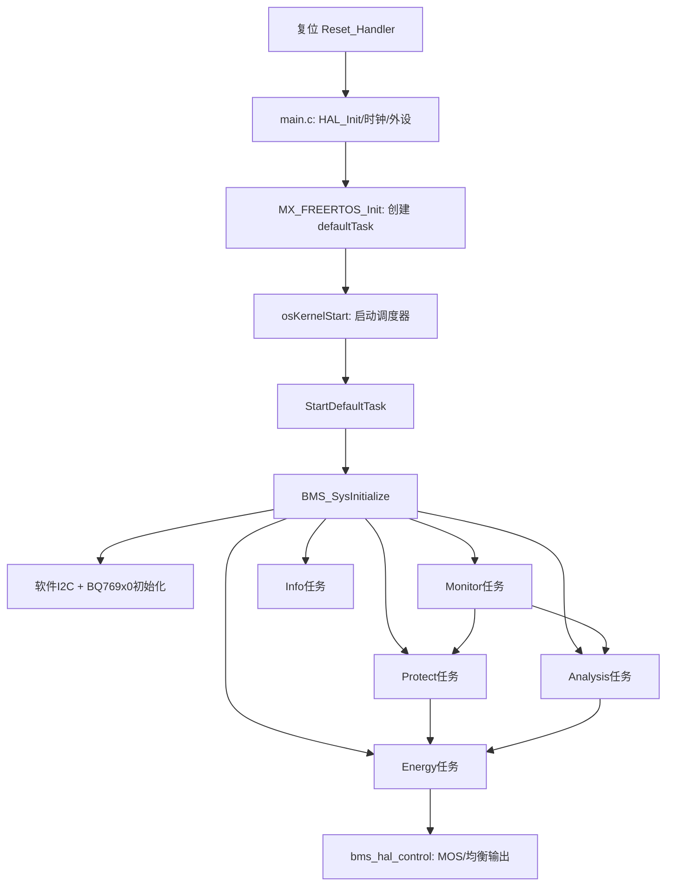
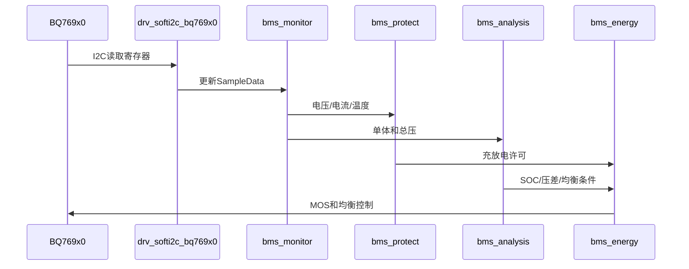

# BMS 项目架构与学习指南

## 项目定位

本工程面向 STM32F103 系列 MCU，使用 STM32F1 HAL、FreeRTOS（通过 CMSIS-RTOS2 API）和 BQ769x0 电池监测芯片，实现多串锂电池的采样、保护、SOC/容量估算、充放电控制及均衡。

## 文件归属与来源

|目录/文件|归属与职责|编写依据|
|---|---|---|
|`Core/Inc`、`Core/Src`|STM32CubeMX 生成的启动、时钟、GPIO、CAN、USART、HAL 适配代码|文件头含 ST 生成模板，属于芯片基础层|
|`Drivers`|FreeRTOS 内核、CMSIS、STM32 HAL 和启动汇编|第三方/芯片厂商代码，通常不应直接修改|
|`User/Drivers`|软件 I2C、BQ769x0、CAN/RS485 等板级驱动|项目自定义驱动层|
|`User/Bms/Hal`|监测、控制、配置和通信的硬件抽象|隔离业务逻辑与引脚/外设细节|
|`User/Bms/Core`|监测、保护、分析、能量、信息等业务任务|BMS 核心业务层|
|`User/Bms/bms_app.c`|系统初始化编排|应用入口层|
|`MDK-ARM/BMS.uvprojx`|Keil 编译目标、宏和文件组|构建配置|

工程没有可靠的个人作者元数据；因此“谁编写”只能按上述生成来源和目录归属判断，不能据此推断具体姓名。

## 启动与任务关系

## 数据流

BQ769x0 通过软件 I2C 提供单体电压、温度、电流和告警状态；`bms_monitor` 将寄存器值转换为工程单位并写入共享数据；`bms_protect` 根据阈值决定充放电许可；`bms_analysis` 计算平均电压、功率、容量和 SOC；`bms_energy` 综合这些状态驱动充电、放电和均衡。

## 每个核心文件怎样工作

### `bms_app.c`：应用编排

`BMS_SysInitialize()` 是业务层总入口。它先填充 `BQ769X0_InitDataTypedef`：把过压、欠压、过流、短路等硬件告警映射到 `bms_protect.c` 的回调；再把 `INIT_*` 参数写入芯片。随后调用 `I2C_BusInitialize()` 和 `BQ769X0_Initialize()`，最后依次创建五类业务任务。它不参与周期计算，职责类似“启动脚本”。

### `bms_monitor.c`：采样生产者

监测任务周期读取 BQ769x0 驱动提供的 `BQ769X0_SampleData`，通过 `bms_hal_monitor.c` 转成业务数据 `BMS_MonitorData`。典型字段包括 `CellVoltage[]`、`BatteryVoltage`、`BatteryCurrent`、`CellTemp[]` 和有效数量。其它任务只应读取这份快照，避免重复访问 I2C。

### `bms_protect.c`：故障状态机

保护模块同时处理两类事件：周期任务检查软件阈值，BQ769x0 告警回调处理硬件比较器事件。过压、欠压、充放电过流、短路和温度故障会改变 `BMS_GlobalParam.Charge/Discharge`；解除保护通常需要恢复阈值和延时条件。调试时应重点观察“触发、锁存、解除”三个状态，而不是只看一个 GPIO 电平。

### `bms_analysis.c`：状态估算

`BMS_AnalysisEasy()` 计算平均单体电压、最大压差和实时功率。容量部分先按温度得到可用容量比例，再使用库仑计量：

$$\Delta Q=I\Delta t/3600$$

SOC 初始化使用 `SocOcvTab[101]` 的 OCV 查表；运行中同时执行 OCV 和安时积分，并把剩余容量限制在 $0$ 到额定容量之间。注意数组排序和单位：驱动通常使用 mV/mA，业务计算可能使用 V/A，跨层查看变量时必须确认缩放。

### `bms_energy.c`：能量执行器

该模块读取保护许可和分析结果，调用 `BMS_HalCtrlCharge()`、`BMS_HalCtrlDischarge()` 控制 MOS；均衡逻辑根据单体压差选择位图，通过 `BMS_HalCtrlCellsBalance()` 打开对应通道，并用软件定时器到期关闭。它是“决策落地层”，不应绕过保护模块直接强制开启功率 MOS。

### `bms_hal_monitor.c` 与 `bms_hal_control.c`：硬件抽象

Monitor HAL 负责“从芯片数据到业务结构体”；Control HAL 负责“从业务状态到 GPIO/芯片寄存器”。这种分层让上层任务不依赖具体引脚。更换 MOS 有效电平、BQ769x0 型号或 PCB 引脚时，优先修改 HAL，而不是修改保护算法。

## 共享数据与并发

`BMS_MonitorData`、`BMS_AnalysisData`、`BMS_GlobalParam` 是跨任务共享对象。当前代码主要依赖单次结构体/标量访问和任务周期错开，没有看到统一互斥锁保护；增加 DMA、ISR 写入或多字段一致性要求时，应引入 mutex、临界区或双缓冲。不要在中断回调中执行 I2C 阻塞操作。

## 实际调试路径

建议在串口日志中依次验证：I2C ACK → 芯片 ID/配置 → 单体电压合理性 → 温度有效数量 → 电流正负号 → 保护回调 → MOS 实际极性。任何一步失败，都不要继续验证下一层。

## 学习顺序

先读 `main.c` 和 `freertos.c`，掌握启动链；再读 `bms_app.c`，建立模块地图；随后沿 `bms_monitor.c → bms_protect.c → bms_energy.c` 跟踪一条采样到 MOS 输出的数据链；最后学习 `bms_analysis.c` 的库仑积分、OCV 查表和温度修正。

## 安全调试要点

`bms_config.h` 中的串数、过压/欠压、过流和温度阈值必须与实际电芯、采样电阻、BQ769x0 型号及 MOS 极性重新核对。修改参数后应先断开功率级，仅用串口观察采样和告警，再逐步验证充电、放电、短路和均衡场景。
