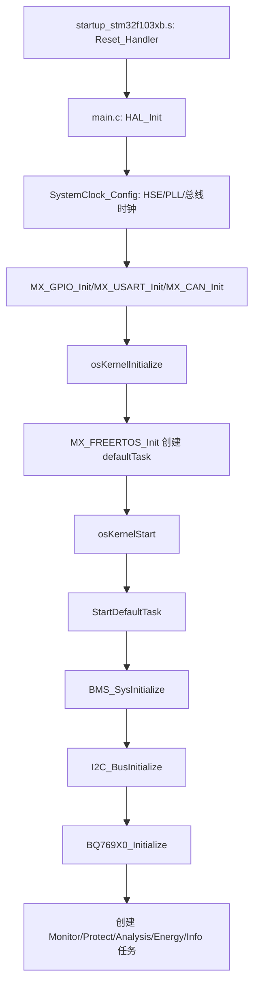
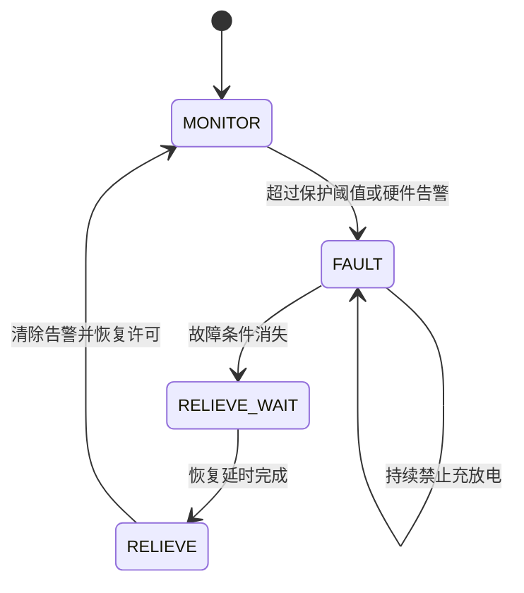

# BMS 锂电池管理系统详细学习手册

## 阅读目标

本手册面向希望独立读懂、编译、调试和修改本工程的开发者。学习完成后，应能回答四个问题：系统从哪里启动、采样数据如何流动、保护何时动作、哪个模块最终控制 MOS。

## 工程事实

|项目|当前工程配置|
|---|---|
|MCU|STM32F103C8（工程宏为 `STM32F103xB`）|
|编译器/工程|Keil MDK，工程文件 `BMS.uvprojx`|
|底层|STM32F1 HAL + CMSIS|
|操作系统|FreeRTOS，应用通过 CMSIS-RTOS2 接口|
|电池监测|BQ769x0 系列，当前配置最多 5 节电芯、1 路温度|
|芯片总线|GPIO 模拟 I²C|
|外部接口|UART、CAN；RS485 驱动位于 User/Drivers|
|功率控制|充电 MOS、放电 MOS、电芯被动均衡|

## 目录和职责

```text
Core/Inc、Core/Src       STM32CubeMX/HAL 外设和 RTOS 启动框架
Drivers/                 ST HAL、CMSIS、FreeRTOS 第三方代码
User/Drivers/            软件 I2C、BQ769x0、CAN、RS485 驱动
User/Bms/Hal/            BMS 硬件抽象，隔离寄存器和 GPIO
User/Bms/Core/           监测、保护、分析、能量、信息业务任务
User/Bms/bms_app.c       总初始化编排
MDK-ARM/BMS.uvprojx      Keil 构建配置
```

## 从复位到运行



`main()` 只负责芯片和 RTOS 框架；`StartDefaultTask()` 才进入 BMS。调度器启动后，主函数中的 `while(1)` 不再承担业务工作。

## 初始化顺序

`BMS_SysInitialize()` 先组装 `BQ769X0_InitDataTypedef`，注册过压、欠压、过流、短路和器件告警回调，再设置保护延时和阈值。随后初始化软件 I²C 和芯片，最后创建业务任务。不能在 I²C 尚未初始化时读取 BQ769x0，也不能重复调用该函数，否则会重复创建任务。

## 任务模型

|任务|主要输入|主要输出|典型职责|
|---|---|---|---|
|Monitor|BQ769x0 采样快照|`BMS_MonitorData`|更新单体电压、总压、电流、温度|
|Protect|`BMS_MonitorData`、硬件告警|`BMS_GlobalParam`、告警位|保护触发、保持、恢复|
|Analysis|监测数据、电流、时间|`BMS_AnalysisData`|压差、功率、容量、SOC|
|Energy|保护许可、SOC、压差|MOS/均衡 HAL|充放电开关和被动均衡|
|Info|所有共享状态|UART/日志|运行信息输出|

任务之间通过共享全局结构体传递数据。当前工程没有为完整快照统一加互斥锁；增加 ISR/DMA 写入时应使用临界区、互斥锁或双缓冲。

## 监测数据详解

`BMS_MonitorData` 包含：

- `CellVoltage[]`：未排序的原始单体电压，适合按物理通道访问。
- `CellData[]`：带 `CellNumber` 的单体数据，分析/均衡时会按电压排序。
- `BatteryVoltage`：电池包总电压。
- `BatteryCurrent`：电池电流，必须确认正负号约定。
- `CellTemp[]`：温度数组。
- `CellTempEffectiveNumber`：有效温度数量，避免使用无效通道。

驱动层负责寄存器换算，Monitor HAL 负责复制、筛选和排序，业务层不应直接读 BQ769x0 寄存器。

## 保护逻辑

保护参数位于 `bms_config.h`，包括单体过压/欠压、充放电过流、短路和高低温阈值。保护通常包含三个阶段：



软件周期检查适合温度、SOC 和持续阈值；BQ769x0 硬件回调适合短路、过流等快速事件。故障验证必须同时观察告警位、全局许可和实际 MOS 引脚。

## SOC 和容量算法

系统启动时通过 OCV 表估算初始 SOC。`SocOcvTab[101]` 将 0% 到 100% 映射到单体电压。运行过程中使用安时积分：

$$\Delta Q=I\Delta t/3600$$

其中 $I$ 为安培，$\Delta t$ 为秒，结果为 Ah。充电增加剩余容量，放电减少剩余容量，并限制在 $0$ 到 `CapacityReal` 范围内。温度修正先计算可用容量比例，再得到实际容量：

$$Q_{real}=Q_{rated}\times K_T$$

必须核对电压、电流和时间单位；单位错误会造成 SOC 快速跳变。

## 充放电和均衡

`bms_energy.c` 根据以下条件综合决策：

- 保护模块是否允许充电/放电；
- SOC 是否达到停止或重新启动阈值；
- 单体电压是否超过均衡起始值；
- 最大最小单体压差是否超过均衡压差；
- 均衡定时器是否到期。

均衡使用 `BMS_CellIndexTypedef` 位图，`bit0` 对应第 1 节电芯。调用 `BMS_HalCtrlCellsBalance()` 前必须确认位图和物理电芯编号的映射，避免均衡错节。

## 硬件接口学习方法

|接口|软件入口|学习重点|
|---|---|---|
|GPIO|`gpio.c`、`bms_hal_control.c`|LED、MOS、I²C 开漏和有效电平|
|模拟 I²C|`drv_soft_i2c.c`|起始、停止、ACK、时序延时|
|BQ769x0|`drv_softi2c_bq769x0.c`|寄存器地址、数据缩放、告警状态|
|UART|`usart.c`、日志宏|初始化、发送阻塞/中断方式|
|CAN|`can.c`、`drv_can.c`|过滤器、帧格式、收发回调|

## 推荐实验顺序

### 实验：只验证启动

观察 LED 每 500 ms 翻转，确认时钟、GPIO 和 FreeRTOS 调度正常。

### 实验：验证 I²C

断开功率级，仅连接 BQ769x0；观察 ACK、芯片 ID 和初始化返回值。示波器检查 SCL/SDA 上升沿和 ACK 位。

### 实验：验证采样

使用稳定直流源逐节输入，比较寄存器原始值、`BQ769X0_SampleData` 和 `BMS_MonitorData`，确认缩放误差与电芯编号。

### 实验：验证保护

通过可控电源缓慢跨过过压/欠压阈值，记录触发时间、告警位、`Charge/Discharge` 状态和 MOS 电平；再恢复到解除阈值，验证恢复延时。

### 实验：验证均衡

人为制造单体压差，确认只有目标位图对应的均衡通道导通，定时器结束后全部关闭。

## 故障定位表

|现象|优先检查|
|---|---|
|任务未运行|`osKernelStart`、任务创建返回值、堆和栈大小|
|I²C 无响应|GPIO 模式、上拉电阻、器件地址、ACK 和时序|
|电压全部为零|BQ 芯片唤醒、采样使能、寄存器地址和供电|
|SOC 跳变|电流符号、积分周期、单位、OCV 表索引和异常值|
|保护不动作|阈值单位、回调注册、告警清除和任务周期|
|MOS 状态相反|`bms_hal_control.c` 有效电平、驱动极性和硬件栅极电路|
|均衡错节|排序后的 `CellNumber` 是否保留、位图映射是否反向|
|运行一段时间崩溃|栈水位、堆耗尽、数组越界、日志阻塞和竞态|

## 修改代码的边界

修改电芯数量、保护阈值和容量时优先改 `bms_config.h`；修改引脚、电平和芯片寄存器时改 HAL/Drivers；修改保护策略改 `bms_protect.c`；修改 SOC 改 `bms_analysis.c`。不要直接修改第三方 HAL、CMSIS 和 FreeRTOS 文件，也不要让业务任务绕过 HAL 直接写 GPIO 或 BQ 寄存器。

## 学习成果检查

完成以下任务即可认为基本掌握工程：能够画出启动调用链；解释 `BMS_MonitorData` 每个字段；修改一个保护阈值并验证触发/恢复；跟踪一次 BQ769x0 寄存器读取；解释 OCV 与安时积分的差异；增加一个串口状态字段；定位一次 MOS 极性错误。
