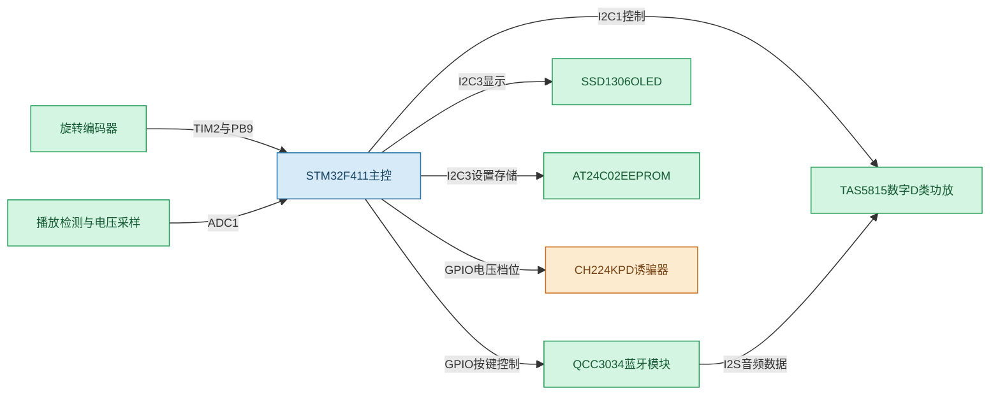
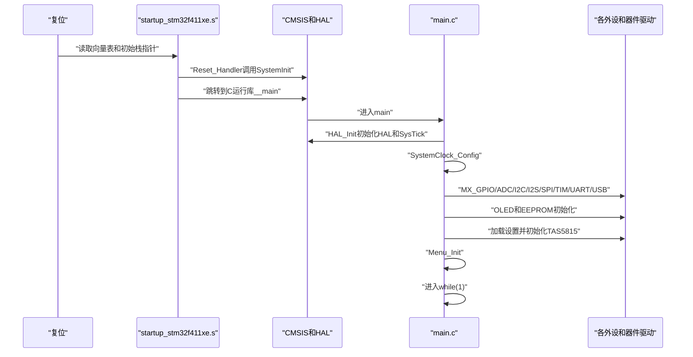
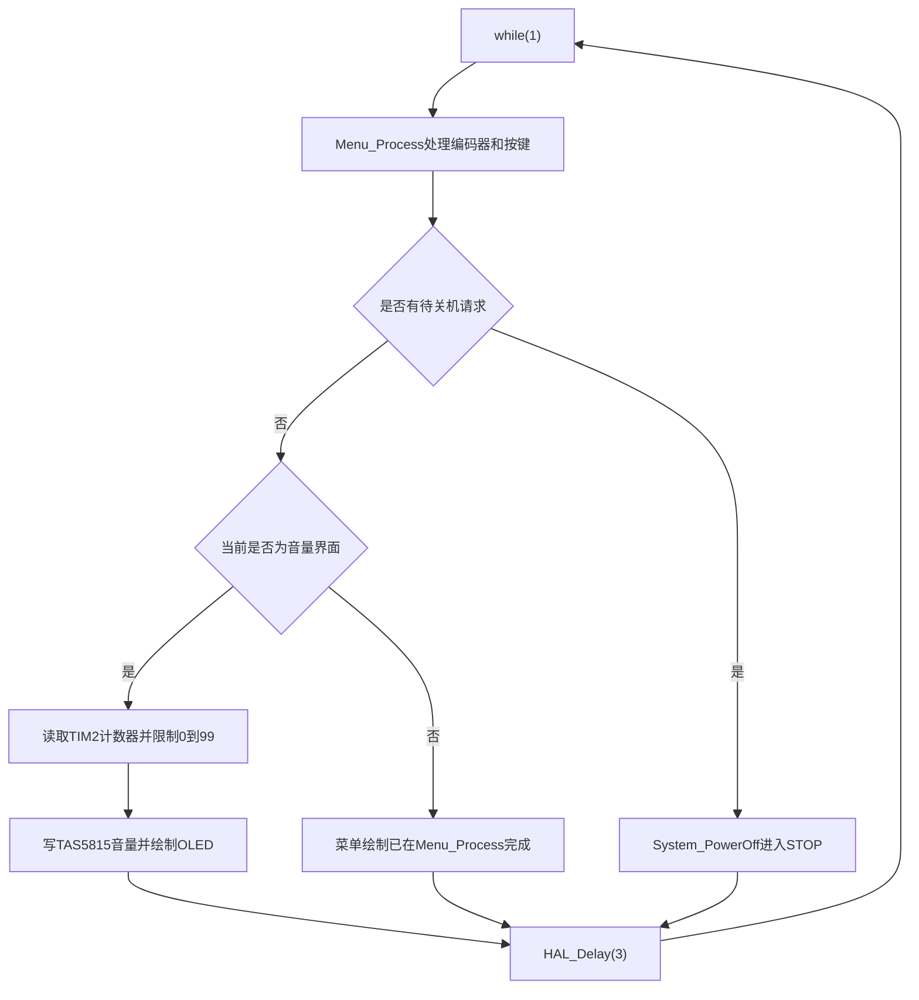
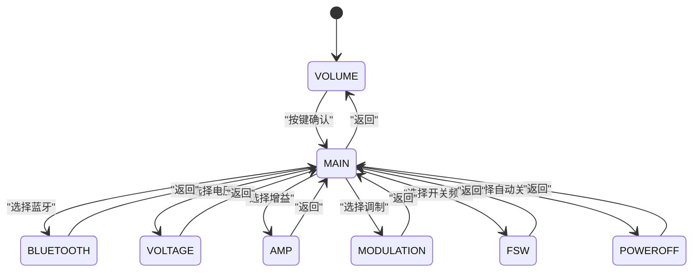
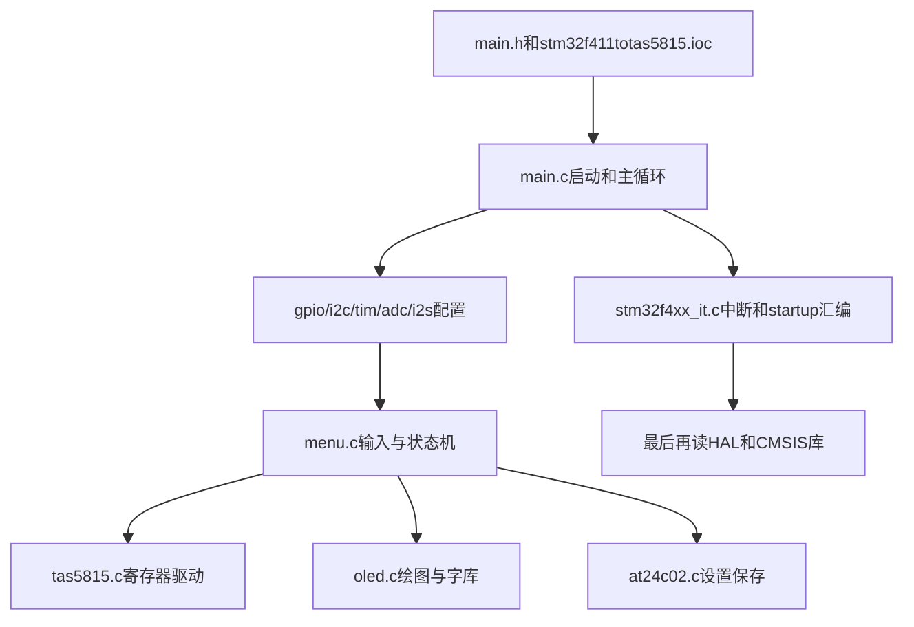

# STM32F411 TAS5815数字音频功放工程学习指南

## 学习目标

这是一套基于STM32F411CEUx的裸机音频功放控制工程。STM32负责系统初始化、TAS5815寄存器控制、OLED界面、旋转编码器、EEPROM设置保存、蓝牙控制、电源电压控制和低功耗待机。

需要先建立一个重要认识：当前工程使用的是“主循环轮询+少量中断”的架构，不是FreeRTOS工程。工程中没有任务、队列、信号量和调度器。

## 工程实际边界

|层次|当前工程中的内容|主要维护者|
|---|---|---|
|芯片启动|向量表、栈、复位入口、`SystemInit()`|ST提供模板，Keil工程选择并编译|
|芯片外设|GPIO、ADC、I2C、I2S、SPI、TIM、USART、USB PCD|CubeMX生成，开发者在`.ioc`中配置|
|硬件抽象|`HAL_GPIO_*`、`HAL_I2C_*`、`HAL_ADC_*`等|ST提供HAL库|
|产品逻辑|音量、菜单、自动关机、启动恢复|项目开发者编写|
|器件驱动|TAS5815、SSD1306、AT24C02|项目开发者或移植第三方驱动|
|字模数据|`font.c`中的字体和图片数组|字模工具生成或人工整理|
|构建工程|`.uvprojx`、启动文件、分组和编译选项|Keil/CubeMX项目配置|

## 目录和文件地图

`MDK-ARM`是Keil项目目录，但应用源码在它的上一级目录。

```text
TAS5815-main/
├─ Core/
│  ├─ Inc/                         头文件和公共接口
│  └─ Src/                         应用、驱动和CubeMX生成的C文件
├─ Drivers/
│  ├─ CMSIS/                       Cortex-M和STM32寄存器定义
│  └─ STM32F4xx_HAL_Driver/       ST的HAL实现
├─ images/tas5815.png              功放外围参考图片
├─ tas5815.pdf                     TAS5815数据手册
├─ stm32f411totas5815.ioc          CubeMX配置源文件
├─ README.md                       项目功能说明
└─ MDK-ARM/
   ├─ stm32f411totas5815.uvprojx  Keil构建工程
   ├─ startup_stm32f411xe.s        STM32F411启动汇编
   └─ ...                          AXF、HEX、调试和构建文件
```

### 应用入口和公共头文件

|文件|作用|应该怎样阅读|
|---|---|---|
|`Core/Src/main.c`|系统入口、公共状态、主循环、时钟和电源管理|第一优先级，从`main()`向下追踪|
|`Core/Inc/main.h`|HAL总入口、GPIO别名、跨文件函数声明|确认一个引脚对应的宏和公共API|
|`Core/Src/system_stm32f4xx.c`|CMSIS系统时钟变量和底层系统支持|理解`SystemInit()`及启动阶段|
|`Core/Src/stm32f4xx_hal_msp.c`|HAL公共底层初始化|理解`HAL_MspInit()`打开的系统时钟|

`main.c`中的`SetVolume()`、`SetVoltage()`、`SetModulation()`和`SetFSW()`是跨模块的产品控制接口。菜单调用这些接口，接口再调用器件驱动或GPIO控制，这样菜单不必知道TAS5815寄存器细节。

### CubeMX生成的外设文件

|文件|外设|当前用途|
|---|---|---|
|`gpio.c/.h`|GPIO、EXTI初始状态|蓝牙控制、PD电压、按键、USB检测、LED|
|`adc.c/.h`|ADC1|PA6播放检测、PB1电压采样|
|`i2c.c/.h`|I2C1、I2C3|I2C1控制TAS5815，I2C3共享OLED和AT24C02|
|`i2s.c/.h`|SPI1复用为I2S1|提供音频时钟、字选择和串行数据引脚|
|`spi.c/.h`|SPI3|配置了PB3/PB4/PB5，当前应用未看到实际发送代码|
|`tim.c/.h`|TIM2编码器模式|PA0、PA1读取旋转编码器计数|
|`usart.c/.h`|USART2|PA2、PA3调试串口，当前应用未看到发送日志|
|`usb_otg.c/.h`|USB OTG FS PCD|PA11、PA12的USB底层控制器初始化|
|`stm32f4xx_it.c/.h`|中断入口|SysTick、USB、EXTI等中断服务入口|

这些文件中的`MX_xxx_Init()`和`HAL_xxx_MspInit()`大部分由CubeMX生成。`.ioc`是配置源，重新生成代码时，生成文件中`USER CODE BEGIN/END`之外的内容可能被覆盖。自定义驱动文件不属于CubeMX生成文件。

### 项目自定义驱动文件

|文件|抽象对象|上层调用|
|---|---|---|
|`tas5815.c/.h`|TAS5815 I2C寄存器驱动|`main.c`和`menu.c`|
|`oled.c/.h`|SSD1306绘图、文字、I2C发送|`main.c`和`menu.c`|
|`at24c02.c/.h`|EEPROM单字节读写和参数保存|`main.c`和`menu.c`|
|`menu.c/.h`|菜单状态机、编码器和按键处理|`main.c`|
|`font.c/.h`|ASCII、中文字体和图片数据|`oled.c`|

这些文件由项目开发者维护。学习时先读头文件接口，再读C文件实现，最后追踪调用者。

## 总体硬件架构



### 引脚和总线表

|引脚|复用或方向|实际作用|软件入口|
|---|---|---|---|
|PA0|TIM2_CH1|编码器A相|`__HAL_TIM_GET_COUNTER()`|
|PA1|TIM2_CH2|编码器B相|TIM2硬件正交解码|
|PB9|EXTI9|编码器按键|`Menu_Process()`轮询，STOP时用于唤醒|
|PB6/PB7|I2C1|TAS5815的SCL/SDA|`tas5815.c`|
|PA8/PB8|I2C3|OLED和AT24C02共享SCL/SDA|`oled.c`、`at24c02.c`|
|PA5/PA7/PA15|I2S1|CK、SD、WS|`i2s.c`配置|
|PA6|ADC1_IN6|播放活动检测|`Read_ADC_Channel()`|
|PB1|ADC1_IN9|PD输出电压分压检测|`Read_ADC_Channel()`|
|PA9/PB10|GPIO输出|CH224K的5V和高压档控制|`SetVoltage()`|
|PA10|GPIO输出|QCC3034使能|`main.c`、`Bluetooth_Pair()`|
|PB12/PB13/PB14|GPIO输出|蓝牙暂停/配对、上一曲、下一曲脉冲|`menu.c`|
|PA11/PA12|USB OTG FS|USB DM/DP|`usb_otg.c`|
|PA2/PA3|USART2|调试串口TX/RX|`usart.c`|
|PB3/PB4/PB5|SPI3|SPI3引脚，当前未见业务发送|`spi.c`|
|PA13/PA14|SWD|调试下载|芯片调试接口|

I2C地址要区分7位地址和HAL传入格式：TAS5815使用7位地址`0x54`，代码中发送`0x54<<1`；OLED使用`0x3C`，代码定义发送地址`0x78`；AT24C02使用7位地址`0x50`，代码调用HAL时使用`0x50<<1`。

## 启动流程



### 启动阶段的关键点

`startup_stm32f411xe.s`不是业务代码，它提供向量表、初始栈、`Reset_Handler`和默认异常处理函数。复位后先执行汇编，再进入C运行库，最后才调用`main()`。

`HAL_Init()`建立HAL使用的时间基准，`SysTick_Handler()`每次Tick调用`HAL_IncTick()`，所以`HAL_Delay()`和`HAL_GetTick()`依赖SysTick正常工作。

`SystemClock_Config()`使用25MHz外部高速时钟HSE和PLL，当前配置结果是系统时钟约60MHz，APB1约30MHz，APB2约60MHz，PLLQ提供USB所需的48MHz。I2S另有PLLI2S时钟。

## 主循环架构



这是协作关系：`Menu_Process()`负责输入和菜单状态，`main.c`负责音量页面、播放检测、电压显示和自动关机。两者共同访问TIM2、OLED、EEPROM和TAS5815。

### 音量调节数据流

TIM2是硬件计数器，不需要CPU逐个处理中断。代码把原始计数右移一位：

$$volume=raw\_counter>>1$$

因此每两个编码器计数对应一个音量步进。音量范围是$0$到$99$，设置软件音量时又把值左移一位写回TIM2：

$$raw\_counter=volume<<1$$

音量变化后立即通过I2C1写TAS5815，但EEPROM不会立即写入，而是等待$2000\text{ ms}$没有继续变化后保存。这是为了减少AT24C02写周期消耗。进入关机前，如果仍有未保存音量，`System_PowerOff()`会强制保存。

## 菜单状态机

`menu.h`定义了`MenuState`、`MenuItem`和`MenuSystem`。其中`MenuItem`使用函数指针保存动作：用户选中一项后，菜单调用该项的`action`函数。



菜单项目数组是静态配置，不是动态创建。每项包含名称、目标状态、动作函数、子菜单指针和子菜单数量。旋转编码器进入菜单后只移动`selectedIndex`；短按执行动作；长按从子菜单返回，音量界面长按则显示关机进度并请求进入STOP。

## TAS5815驱动

### 软件分层

```text
main.c或menu.c
    ↓调用产品级接口
tas5815_Initialize()/set_tas5815_volume()/tas5815_set_fsw()
    ↓组装寄存器地址和值
TAS5815_WriteReg()
    ↓HAL_I2C_Master_Transmit(hi2c1,0xA8,...)
STM32I2C1
    ↓PB6/PB7
TAS5815SCL/SDA
```

驱动中的寄存器重点如下：

|寄存器|宏|当前用途|
|---|---|---|
|`0x02`|`DEVICE_CTRL1`|调制模式和开关频率字段|
|`0x03`|`DEVICE_CTRL2`|DSP复位、静音、Hi-Z和播放状态|
|`0x33`|`SAP_CTRL1`|I2S串行音频格式|
|`0x4C`|`DIG_VOL`|数字音量|
|`0x53`|`ANA_CTRL`|D类环路带宽|
|`0x54`|`AGAIN`|模拟增益|

`tas5815_Initialize()`按“等待电源稳定、进入安全状态、配置I2S、配置调制和频率、设置增益和音量、进入播放状态”的顺序写寄存器。`tas5815_set_modulation(3)`需要先退出普通调制、进入Hi-Z、切换Hybrid、等待后再回到Play，这说明某些寄存器不能在任意工作状态下直接切换。

### 必须区分的音频路径事实

当前源码中，`i2s.c`只配置了SPI1/I2S1外设和PA5、PA7、PA15引脚，没有找到`HAL_I2S_Transmit`、DMA音频缓冲或USB Audio Class代码。因此可以确认“配置了I2S外设”，但不能仅凭当前工程源码确认“USB音频解码已经完成”。`usb_otg.c`是PCD底层控制器初始化，不等于USB设备协议栈，更不等于USB音频类驱动。

## OLED驱动

OLED驱动采用SSD1306常见的页寻址模式，屏幕为$128\times64$像素，显存定义为：

```c
uint8_t OLED_GRAM[8][128];
```

每个字节表示同一列的8个垂直像素，因此总显存是$8\times128=1024$字节。

绘图流程是：


`OLED_NewFrame()`和`OLED_ShowFrame()`构成软件双阶段绘图：先在RAM中完整绘制，再一次性刷新屏幕。它不是两块显存交替，而是“绘图缓冲区+硬件刷新”。`font.c`保存字模数据，`OLED_PrintString()`先识别UTF-8长度，再搜索字体表，找不到中文或ASCII时使用默认ASCII字体。

## AT24C02参数存储

每个参数占两个字节：一个数据字节和一个有效标志字节。

|参数|数据地址|标志地址|标志值|
|---|---:|---:|---:|
|音量|`0x00`|`0x01`|`0xA5`|
|电压|`0x02`|`0x03`|`0x5A`|
|调制|`0x04`|`0x05`|`0x3C`|
|FSW|`0x06`|`0x07`|`0xC3`|
|自动关机|`0x08`|`0x09`|`0xD7`|
|AMP增益|`0x0A`|`0x0B`|`0xE1`|

保存流程是先写标志再写数据，加载流程是先读标志，标志正确后再读数据并检查范围。这里的标志只能判断“这组数据曾经被写过”，不是CRC，也不能发现数据字节和标志字节之间的断电一致性问题。

I2C3被OLED和EEPROM共享。当前代码是裸机顺序调用，没有RTOS并发访问；以后增加中断、DMA或后台任务时，必须增加总线访问保护。

## 播放检测和电压显示

PA6通过ADC1通道6采样播放检测信号。主循环每次在音量页面读取多次，只要任意采样值大于`1240`就把最近播放时间更新为当前Tick；最近一次检测后的$100\text{ ms}$内显示`START`，否则显示`STOP`。

PB1通过ADC1通道9读取PD输出分压。代码使用51k和10k电阻，分压还原公式是：

$$V=ADC\times3.3\times6.1/4095$$

`ADC`是$0$到$4095$的12位转换结果，$3.3$是ADC参考电压，$6.1$是分压还原系数。

## 电压控制和低功耗

`SetVoltage()`是唯一应使用的电压控制入口。当前逻辑为：

|菜单值|PA9|PB10|代码含义|
|---:|---|---|---|
|0|高|低|5V|
|1|低|低|12V|
|2|低|高|代码注释/菜单显示为高压档|

当前菜单把值2显示为`15V`，而项目说明又把硬件描述为20V档。学习和调试时应以实际CH224K配置、示波器和万用表测量结果为准，不能只依据变量名称。

关机流程是：保存未写入音量、切换低压档、关闭蓝牙、让TAS5815休眠、关闭OLED、暂停Tick、配置PB9和PB0唤醒、进入STOP。唤醒后重新配置系统时钟、恢复Tick、恢复电压、打开OLED、重新打开蓝牙、唤醒TAS5815并恢复音量。

## 中断和主循环的关系

`stm32f4xx_it.c`提供硬件要求的固定函数名：

|中断|当前处理|
|---|---|
|`SysTick_Handler`|调用`HAL_IncTick()`维护HAL时间基准|
|`OTG_FS_IRQHandler`|调用`HAL_PCD_IRQHandler()`|
|`EXTI0_IRQHandler`|调用PB0的HAL EXTI处理|
|`EXTI9_5_IRQHandler`|调用PB9的HAL EXTI处理|
|异常处理函数|默认进入死循环，便于调试器停住|

虽然PB0和PB9配置了EXTI，但当前菜单按键和PB0状态主要由主循环轮询读取；EXTI主要在STOP唤醒阶段提供唤醒事件。这是“中断唤醒、主循环处理”的设计。

## 当前源码中需要重点认识的风险

|现象|影响|学习结论|
|---|---|---|
|`main.c`重复调用I2S、SPI、TIM、UART、USB初始化|可能重复配置外设，增加运行时风险|区分“能链接”与“初始化逻辑正确”|
|README描述USB解码，但源码缺少USB Audio Class层|USB底层初始化不代表USB音频可用|继续学习时先补协议栈和数据流证据|
|I2S配置为`I2S_DATAFORMAT_16B`，TAS5815注释配置为24bit|两端音频字长可能不一致|需要结合QCC3034输出格式和逻辑分析仪确认|
|`tas5815_set_analog_gain()`没有更新全局当前增益|菜单可以写入芯片和EEPROM，但运行态没有对应缓存|重启加载时仍可恢复，界面指示依赖EEPROM读取|
|EEPROM保存先写标志再写数据|掉电时可能出现标志有效但数据旧|产品级设计应考虑版本、校验和双备份|
|`OLED_Send()`使用`HAL_MAX_DELAY`|I2C异常时主循环可能长时间阻塞|量产代码应设计超时和错误恢复|
|`Error_Handler()`关闭中断后死循环|外设初始化失败时系统不会自动恢复|调试阶段可接受，产品需故障指示|
|多个注释和字符串在部分终端显示乱码|可能是源文件编码、编译输入编码或终端显示不一致|修改前先确认文件编码，避免批量转码破坏源码|

## 推荐阅读顺序



学习每个函数时，固定回答这几个问题：

|问题|示例|
|---|---|
|谁调用它|主循环、菜单动作、HAL回调或中断|
|输入单位是什么|Tick、毫秒、ADC计数、GPIO电平、I2C地址|
|它修改了什么|变量、寄存器、GPIO、OLED显存或EEPROM|
|调用后硬件发生什么|产生I2C波形、改变PD控制、发送显示数据|
|失败怎样处理|返回错误、进入`Error_Handler`、继续使用默认值|
|是否可以在中断调用|不能阻塞的函数不得放进ISR|

## 如何修改工程

配置类修改优先在CubeMX打开`.ioc`完成，然后重新生成代码并检查自定义逻辑。应用逻辑修改放在`main.c`、`menu.c`或自定义驱动中；CubeMX文件只能在对应`USER CODE`区域增加代码。修改后按以下顺序验证：

```text
检查差异和编码
    ↓
Keil Rebuild all target files
    ↓
确认0 Error并检查Warning来源
    ↓
下载HEX或AXF
    ↓
串口、万用表、逻辑分析仪和示波器验证
    ↓
长时间播放、关机、唤醒和掉电保存测试
```

当前截图已经证明某次构建是`0 Error(s)`，但编译成功不能证明I2C地址、PD电压、I2S格式、USB功能或真实扬声器输出一定正确。嵌入式工程必须把编译、下载、运行和仪器验证分开判断。

## 第一阶段结论

这个工程的核心不是“一个TAS5815寄存器文件”，而是一个小型产品控制系统：STM32使用HAL完成硬件初始化，用主循环协调用户输入、UI刷新、功放控制、设置存储和电源状态，用I2C控制TAS5815/OLED/EEPROM，用TIM2读取编码器，用ADC判断播放和电压，用GPIO控制蓝牙和PD。

下一阶段最适合逐文件精读：先完整讲`main.c`，再讲`menu.c`，随后讲`tas5815.c`的每个寄存器和I2C波形，最后讲OLED显存与AT24C02写入时序。
