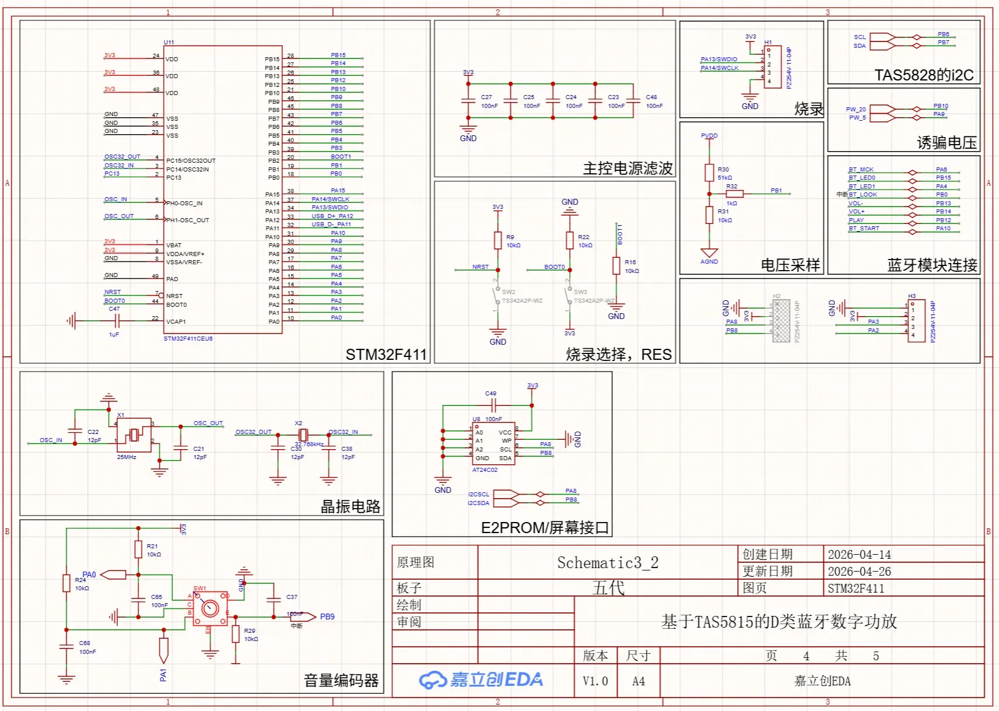
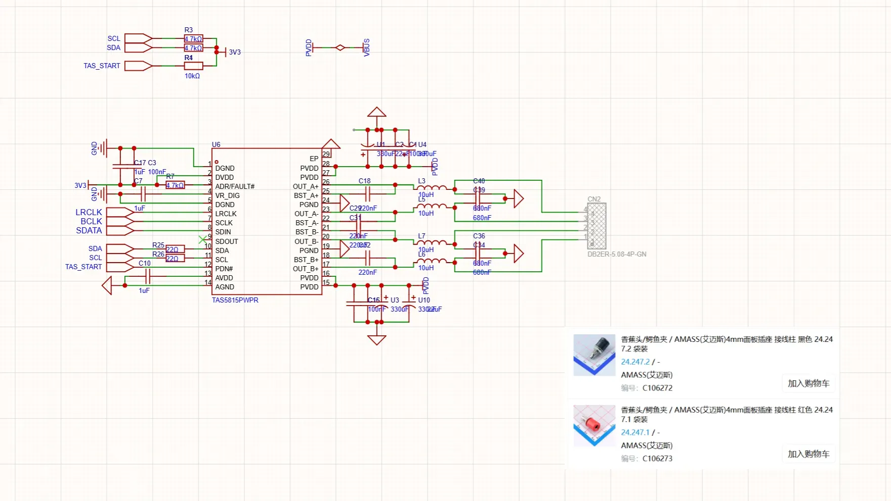
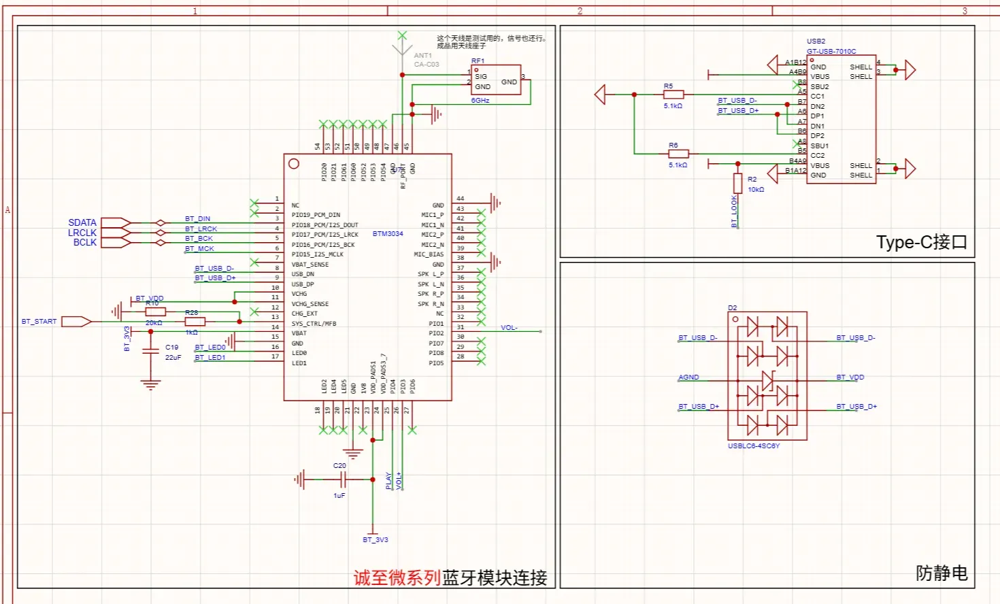
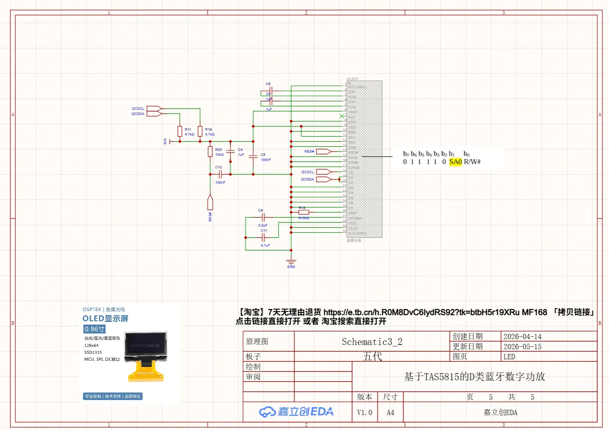
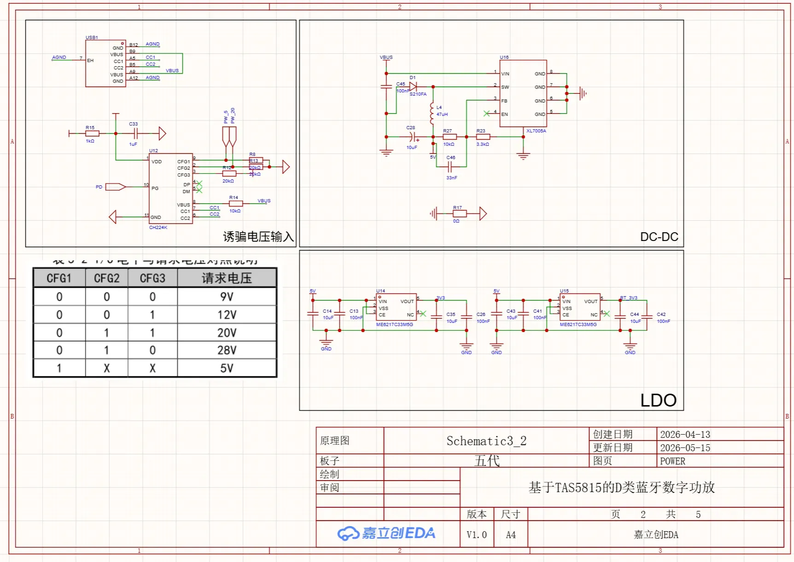
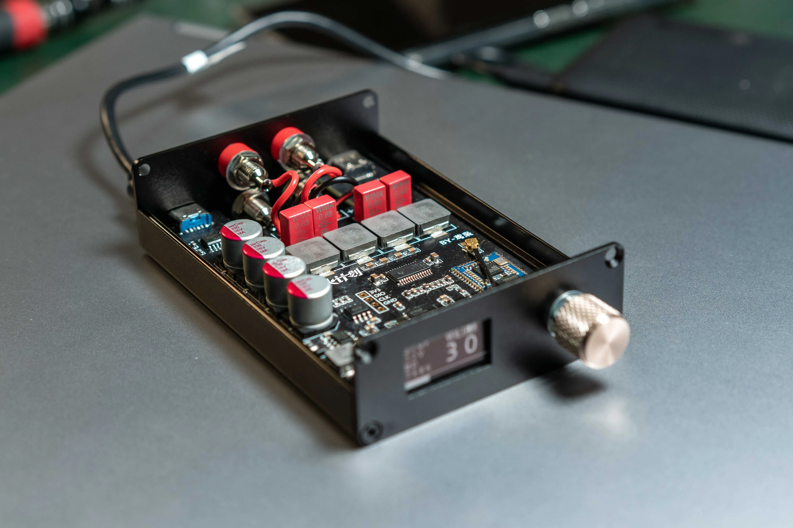
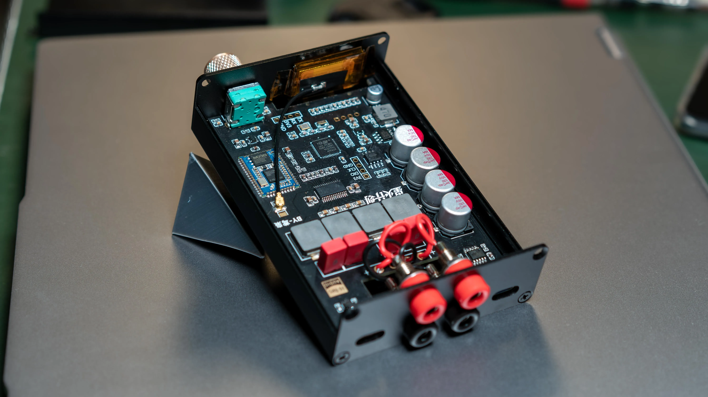
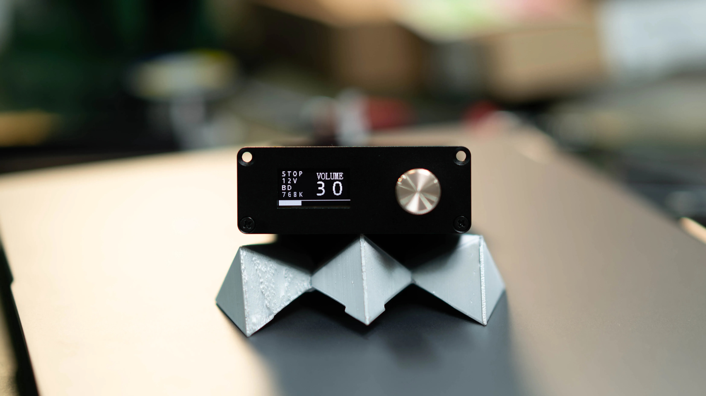
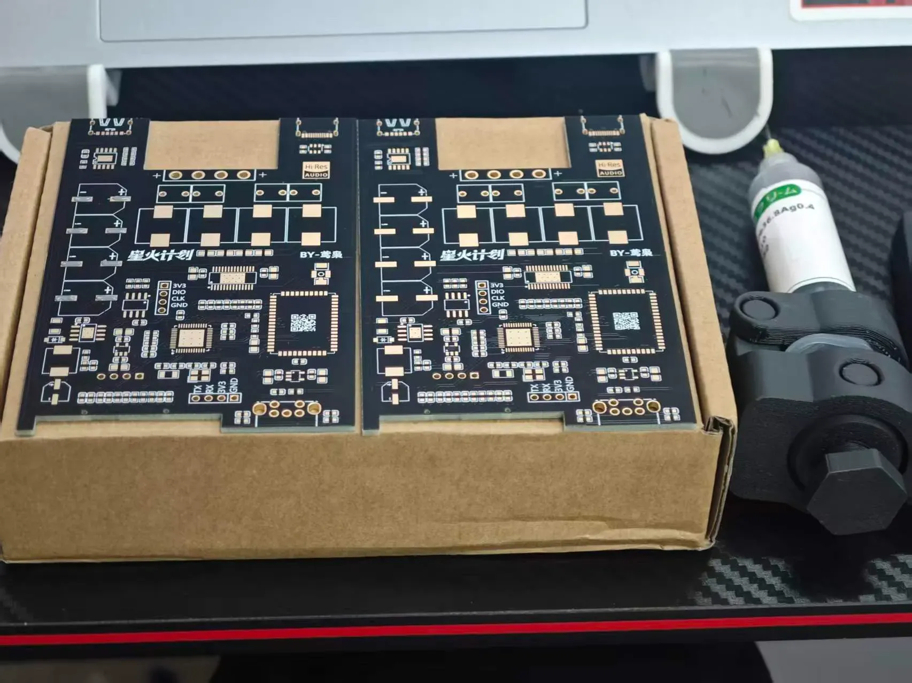
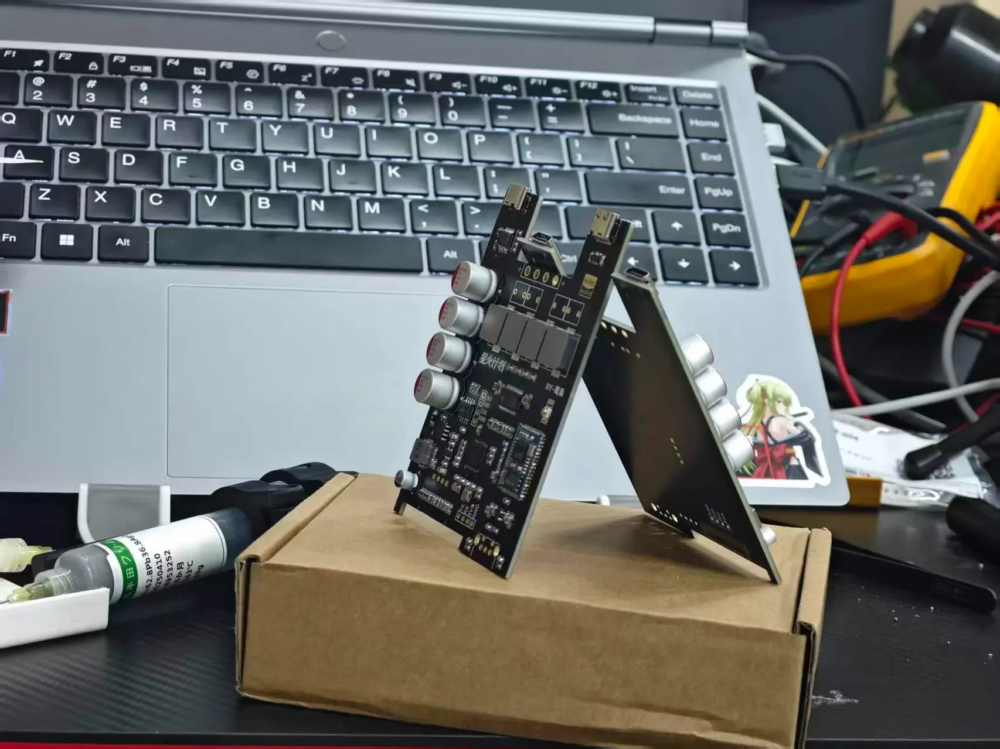

# STM32F411 TAS5815数字音频功放项目介绍

## 1. 项目简介

STM32F411 TAS5815数字音频功放项目是一个基于STM32F411主控芯片和TAS5815 D类功放芯片的高性能数字音频解决方案。项目整合了蓝牙和USB解码功能，采用全数字链路设计，实现了从QCC3034蓝牙模块直接输出I2S数字音频信号到TAS5815功放芯片的完整数字音频传输路径，确保了音频信号的高保真传输。

该项目专为电脑桌面播放器场景设计，能够满足用户对高品质桌面音频系统的需求。系统支持TYPEC接口连接，左侧TYPEC接口可连接支持PD协议的电源适配器，右侧TYPEC接口连接电脑，使用便捷。项目具备智能电源管理功能，包括上电自动开机、音量和设置记忆、低功耗待机等特性，提升了用户体验。

在核心技术方面，该项目采用D类数字功放技术，具有高效率、低功耗的优势。系统提供了调制频率和调制模式的选择。系统使用PD诱骗器连接支持PD协议的充电器，提供三档电压可选。关机状态下系统诱骗5V电压，实现低功耗待机，关机状态功耗小于0.1W，正常播放时功耗约1.7W（使用时可不加散热片），峰值功耗可达60W（一般使用场景下不会达到此功耗）。

项目硬件配置完整，主控采用STM32F411芯片，功放使用TAS5815芯片，蓝牙模块采用诚至微QCC3034，显示屏为0.96寸SSD1315（**鱼鹰光电**），记忆芯片为AT24C02，降压模块为XL7005A，PD诱骗器为CH224K。该系统支持智能开关机功能，检测到USB来电或按下编码器即刻进入开机模式，在主界面长按编码器关机，或者长时间无播放自动关机，也可设计随主机启动和关闭模式。

## 2. 功能介绍

本章节介绍STM32F411 TAS5815数字音频功放项目的各项核心功能，包括音频播放、蓝牙连接、USB解码、音量控制、自动开关机、播放检测、PD电压控制等关键特性。

### 2.1 音频播放功能

项目采用全数字链路设计，音频信号通过I2S接口进行数字传输。QCC3034蓝牙模块或USB接口接收的音频数据，直接以I2S格式输出到TAS5815数字功放芯片，实现端到端的数字音频处理。I2S1接口配置在PA5（CLK）、PA7（SD）、PA15（WS），将音频数据路径直接传输至TAS5815，避免了传统模拟链路中的数模转换环节，确保音质的纯净和低失真。

### 2.2 蓝牙连接功能

项目集成诚至微QCC3034蓝牙模块，支持蓝牙音频播放。蓝牙模块通过GPIO引脚与STM32F411交互：PA10控制蓝牙使能，PB12、PB13、PB14分别控制播放/配对、音量减小/上一曲、音量增加/下一曲功能。蓝牙配对流程为：PA10拉低500ms后拉高，PB13拉高1s后拉低实现配对。需要特别注意的是，由于QCC3034的特性，在蓝牙连接时USB播放功能会被禁用。

### 2.3 USB解码功能

项目支持USB音频解码，通过PA11/PA12的USB接口接收电脑端的音频数据。USB检测引脚为PB0，当检测到USB来电时系统会自动进入开机模式。USB解码与蓝牙解码互斥，同一时间只能激活一种音频输入源，在蓝牙连接的时候，usb解码器显示连接但无声音。（芯片特性）

### 2.4 音量控制机制

音量控制采用旋转编码器实现，编码器连接至TIM2定时器的PA0/PA1引脚。硬件每计数2次对应音量变化1步，通过软件移位操作实现音量值转换（`volume = raw_counter &gt;&gt; 1`）。音量调节范围为0-99，默认值为30。编码器按键位于PB9，短按用于确认操作，长按超过1秒用于返回上级菜单。音量设置通过I2C接口写入TAS5815芯片，实现精确的数字音量控制。

### 2.5 自动开关机功能

项目设计了完善的自动开关机机制，支持上电自动开机、按键关机、自动关机等多种模式。上电时检测到USB来电或按下编码器即刻进入开机模式。关机可通过在主界面长按编码器、长时间无播放自动关机，或设置为随主机启动和关闭模式实现。关机时系统会先将电压降至5V，然后进入STOP低功耗模式，关机状态功耗小于0.1W。唤醒源包括PB9（编码器按键）和PB0（USB检测），唤醒后自动恢复保存的电压设置和音量。

自动关机模式可在菜单中配置：无播放10分钟关机、无播放30分钟关机（默认）、随主机开关机（由PB0下降沿触发）、或禁用自动关机功能。

### 2.6 播放检测功能

系统通过ADC实现播放状态检测。ADC_CHANNEL_6（PA6）连接检测电路，阈值设定为1240（约1V）。每次检测采样10次，只要有一次采样超过阈值即判定为正在播放。播放状态会持续100ms，用于OLED显示和自动关机计时器。播放检测功能确保系统能够准确识别音频活动，实现智能的电源管理。

### 2.7 PD电压控制功能

项目集成CH224K PD诱骗器，支持三档电压选择（5V、12V、20V）。电压控制通过PA9（PD_5V）和PB10（PD_20V）两个GPIO引脚实现：5V时PA9为HIGH、PB10为LOW；12V时两者均为LOW；20V时PA9为LOW、PB10为HIGH。系统提供`SetVoltage()`和`RestoreVoltage()`函数进行电压切换，避免直接操作GPIO。关机时默认使用5V电压，实现低功耗待机。

### 2.8 音量和设置记忆功能

项目配备AT24C02 EEPROM存储芯片，通过I2C3总线（PA8、PB8）连接，实现音量和系统设置的持久化存储。EEPROM布局包括音量、电压、调制、FSW、关机模式、AMP增益等参数的存储地址和标志位。所有菜单设置都会保存到EEPROM，并在菜单界面显示小圆点指示器标识已保存的选项。音量保存采用节流机制，2秒空闲后才写入EEPROM（`VOLUME_SAVE_DELAY = 2000`），避免频繁写入影响存储寿命。

### 2.9 TAS5815功放芯片调制频率和调制开关频率介绍

#### 一、两个核心频率概念

**调制开关频率 FSW（PWM 载波频率）**

即功率级 MOSFET 开关频率，决定 PWM 载波基频。
TAS5815 只支持两档：

- 384 kHz（默认 / 常用）
- 768 kHz（高频）

**调制模式（Modulation Scheme）**

决定 PWM 波形样式、噪声、EMI、滤波器选择：

**BD 调制**（推荐低压 / 磁珠滤波）

- 每路输出 0 ↔ PVDD，差分工作
- 可只用磁珠 + 电容，省去大电感
- 噪声低、EMI 好、THD 优

**1SPW 调制**（高压 / 小电感）

- 单端 PWM，效率高、静态电流小
- 适合768 kHz + 小电感 LC（4.7μH）

**Hybrid 调制**：BD/1SPW 混合，一般不用

**D 类环路带宽（Class D Loop Bandwidth）**

影响闭环响应、失真、稳定性
两档：120 kHz（BD 常用）、175 kHz（1SPW 常用）

## 3. 项目参数

### 3.1 输出功率

TAS5815功放芯片支持多种输出功率配置，满足不同应用场景需求：

| 输出模式 | 负载阻抗 | 供电电压 | THD+N | 输出功率 |
|---------|---------|---------|-------|---------|
| 2.0立体声 | 6Ω | 21V | 1% | 2 × 30W |

在2.0立体声模式下，6Ω负载、21V供电电压、THD+N=1%的条件下，可提供每通道30W的输出功率。单通道模式下，3Ω负载、21V供电电压、THD+N=1%的条件下，可提供高达58W的输出功率。

### 3.2 音频性能指标

TAS5815在音频性能方面表现优异，具备高品质音频输出能力：

| 参数 | 测试条件 | 典型值 |
|-----|---------|-------|
| THD+N | 1W、1kHz、PVDD=12V | ≤ 0.03% |
| SNR（信噪比） | A加权，PVDD=24V | ≥ 110dB |
| SNR（信噪比） | A加权，PVDD=13.5V | 106dB |
| ICN（空闲声道噪声） | AES17权重，PVDD=24V | ≤ 45μVrms |
| ICN（空闲声道噪声） | AES17权重，PVDD=13.5V | 40μVrms |
| PSRR（电源抑制比） | 1kHz、1Vrms注入噪声 | 72dB |
| 串扰 | 1kHz | 100dB |

### 3.3 电源效率

TAS5815采用高效D类功放设计，具有出色的电源转换效率：

- **电源效率**：&gt; 90%
- **漏源导通电阻**：120mΩ

高效率设计确保了功放在正常工作时产生的热量较少，降低了散热需求，提升了系统的整体可靠性。

### 3.4 工作电压范围

TAS5815支持宽范围电压输入，适应不同电源环境：

| 电源类型 | 最小值 | 标称值 | 最大值 | 单位 |
|---------|-------|-------|-------|-----|
| PVDD（功放主电源） | 4.5 | - | 26.4 | V |
| DVDD（数字电源） | 1.62 | 1.8/3.3 | 3.63 | V |

PVDD电源范围覆盖4.5V至26.4V，满足从便携式到桌面级应用需求。DVDD支持1.8V或3.3V两种标准逻辑电平，便于与不同MCU接口。

### 3.5 音频采样率与格式

TAS5815支持多种音频采样率和数据格式，具备良好的兼容性：

**支持的采样率**：

- 32kHz
- 44.1kHz
- 48kHz
- 88.2kHz
- 96kHz

支持三线制数字音频接口，无需MCLK时钟，简化了系统设计。同时支持96kHz处理器采样率和8步H类直流/直流控制，提升音频处理精度。

### 3.6 系统功耗参数

本项目的功耗设计充分考虑了节能和高效需求：

| 工作状态 | 功耗 | 说明 |
|---------|-----|------|
| 关机状态 | &lt; 0.1W | 使用5V诱骗，实现低功耗待机 |
| 正常播放 | 1.7W | 典型播放场景，可不加散热片 |
| 峰值功耗 | 60W | 最大输出功率时（一般不常用） |

系统通过PD诱骗器CH224K实现三档电压可选，关机时自动切换至5V诱骗模式，将功耗控制在0.1W以下。正常播放状态下功耗仅约1.7W，热耗散较小，散热设计简化。峰值功耗可达60W，但实际应用中很少达到此水平。

---

## 4. 系统组成

本系统采用模块化设计，硬件架构以STM32F411为主控，搭配TAS5815数字功放芯片和QCC3034蓝牙模块，实现全数字音频链路。软件架构基于裸机开发，采用主循环+中断机制，通过I2C总线管理多个外设，并支持设置记忆和低功耗模式。

### 4.1 硬件架构

#### 主控芯片：**STM32F411**

STM32F411作为系统核心，负责所有外设的控制和数据流管理。芯片工作频率为100MHz，内置256KB Flash和128KB SRAM，提供充足的存储空间。主要外设资源包括：

- I2C1 (PB6/PB7)：连接TAS5815功放芯片，地址0x54
- I2C3 (PA8/PB8)：共享连接OLED显示屏 (0x3C) 和AT24C02存储芯片 (0x50)
- TIM2编码器模式 (PA0/PA1)：用于音量控制，2个硬件计数对应1个音量步进
- ADC1通道6 (PA6)：播放检测，阈值&gt;1240 (约1V) 判断是否有音频播放
- USART2 (PA2/PA3)：调试串口输出
- SWD接口 (PA13/PA14)：JLink调试和程序下载

#### 功放芯片：**TAS5815**

TAS5815是Texas Instruments的高性能D类数字功放芯片，具有立体声PWM输出和内置音频DSP。芯片集成四个主要构建块：

1. 立体声数字至PWM转换块，实现高质量音频信号转换
2. 音频DSP子系统，提供数字信号处理能力
3. 灵活的闭环放大器，支持多种开关频率、输出电压和负载配置
4. I²C控制端口，用于与STM32通信

TAS5815需要双电源供电：DVDD为低压数字电路供电，PVDD为音频放大器输出级供电。内部LDO将PVDD转换为5V，为GVDD和AVDD供电。芯片通过I2C接口接收STM32的控制指令，支持音量调节、增益设置等功能。

#### 蓝牙模块：**QCC3034**

QCC3034是诚至微的蓝牙音频模块，负责蓝牙音频接收和解码。模块特性包括：

- 通过I2S接口直接输出数字音频至TAS5815，实现全数字链路
- 支持蓝牙配对、播放/暂停、音量控制等功能
- 播放检测信号，高电平有效
- USB检测，高电平有效，设置为外部中断
- 蓝牙使能启动引脚

#### 显示屏：SSD1315

采用0.96寸OLED显示屏（鱼鹰光电），分辨率128×64，用于显示系统状态、音量、电压等信息。显示屏通过I2C3接口连接，地址0x3C，使用双缓冲机制优化显示性能。主循环中持续刷新屏幕，显示当前菜单状态和设置信息。{【淘宝】7天无理由退货 https://e.tb.cn/h.R0M8DvC6IydRS92?tk=btbH5r19XRu MF168 「拷贝链接」点击链接直接打开 或者 淘宝搜索直接打开}

#### 存储芯片：AT24C02

AT24C02是2KB容量的EEPROM存储芯片，用于持久化系统设置。通过I2C3接口连接，地址0x50。存储布局包括：

- 0x00/0x01：音量值及校验标志 (0xA5)
- 0x02/0x03：电压设置及校验标志 (0x5A)
- 0x04/0x05：调制模式及校验标志 (0x3C)
- 0x06/0x07：FSW设置及校验标志 (0xC3)
- 0x08/0x09：自动关机设置及校验标志 (0xD7)
- 0x0A/0x0B：AMP增益及校验标志 (0xE1)

音量保存采用限流机制，2秒无操作后才写入EEPROM，避免频繁写入影响寿命。

#### 降压模块：XL7005A

XL7005A是高压降压模块，输入电压范围宽，输出稳定5V为系统供电。模块配合PD诱骗器使用，根据TAS5815的工作需求动态调整输入电压。

#### PD诱骗器：CH224K

CH224K是USB-PD协议诱骗芯片，用于从支持PD协议的充电器获取所需电压。控制引脚配置：

- PA9 (PD_5V)：高电平选择5V
- PB10 (PD_20V)：高电平选择20V
- 两个引脚均为低电平时选择12V

电压检测通过ADC通道9 (PB1) 实现，使用51k/10k分压电阻，计算公式为 V = ADC × 3.3 × 6.1 / 4095。

### 4.2 软件架构

#### 主循环流程

软件采用裸机开发，主循环负责处理所有非中断任务。主循环入口在`Core/Src/main.c`的`main()`函数，初始化所有外设后进入无限循环。主循环执行流程：

1. 调用`Menu_Process()`处理编码器旋转和按键事件，实现菜单导航
2. 检查`Menu_IsPowerOffPending()`，如果为真则调用`System_PowerOff()`进入STOP模式
3. 如果当前菜单状态为音量调节，读取TIM2编码器值，限制在0-99范围内，设置TAS5815音量，并在OLED屏幕上显示音量进度条和状态信息
4. 3ms延时

主循环保证系统及时响应编码器操作和播放检测，同时避免忙等待，降低功耗。

#### I2C总线布局

系统使用两条I2C总线：

- I2C1 (PB6/SCL, PB7/SDA)：仅连接TAS5815功放芯片 (地址0x54)，独立控制确保音量调节的实时性
- I2C3 (PA8/SCL, PB8/SDA)：共享连接OLED显示屏 (0x3C) 和AT24C02 EEPROM (0x50)

I2C3总线被OLED和EEPROM共享，当前代码采用顺序访问方式，避免并发冲突。需要特别注意避免在显示刷新和设置保存时同时访问I2C3总线。

#### 编码器音量控制机制

音量控制采用旋转编码器，通过TIM2定时器编码器模式实现。PA0/PA1分别连接编码器的A/B相。音量与硬件计数的关系为：volume = raw_counter &gt;&gt; 1，即2个硬件计数对应1个音量步进。设置音量时使用`__HAL_TIM_SET_COUNTER(&amp;htim2, volume &lt;&lt; 1)`。音量范围为0-99，默认值30。上限将计数器限制到198（音量99），下限重置为0。编码器按键 (PB9) 设置为外部中断，短按确认选择，长按超过1秒返回上一级菜单。

#### EEPROM存储布局

AT24C02 EEPROM用于存储所有菜单设置，每个设置占用2字节（1字节数据 + 1字节校验标志）。音量保存采用限流机制，2秒无操作后才写入EEPROM，避免频繁写入。菜单界面会显示小圆点指示器 (x=113, r=4)，标记当前已保存的选项。所有设置在修改后立即写入EEPROM，系统重启后自动加载。

#### Power-Off（STOP Mode）机制

系统支持低功耗STOP模式，实现自动关机和手动关机功能。`System_PowerOff()`在进入STOP模式前将电压设置为5V，唤醒源包括编码器按键 (PB9) 和USB检测 (PB0)。唤醒后恢复保存的电压，清空OLED屏幕，唤醒TAS5815，恢复音量设置。进入STOP模式前会刷新所有待保存的EEPROM数据。

自动关机模式在菜单中配置，支持四种模式：

- 模式0：无播放10分钟自动关机
- 模式1：无播放30分钟自动关机（默认）
- 模式2：跟随主机（PB0下降沿触发）
- 模式3：禁用自动关机

播放检测通过ADC通道6实现，阈值&gt;1240 (约1V) 判断为播放状态。每次检查10个样本，任何一个样本超过阈值即判定为播放。播放状态持续100ms用于显示和自动关机计时。

---

## 5. 实物展示

本章节展示STM32F411 TAS5815数字音频功放项目的实物照片，包括系统整体组装效果和关键组件的实物特写。

### 5.1 成品展示（未盖上盖）

### 5.2 板子实物

## 6. 注意事项

在使用本数字音频功放项目时，需要注意以下重要事项：

&gt; ⚠️ **连接特性与电源要求**：由于QCC3034蓝牙模块的特性，当设备处于蓝牙连接状态时，USB播放功能会自动被禁用，这是芯片本身的限制，可通过菜单的重新配对蓝牙彻底断开蓝牙连接。电源方面，必须使用支持PD协议的适配器。设备左侧的TYPEC接口用于连接PD适配器，右侧的TYPEC接口用于连接电脑或其他USB音频源。

&gt; ⚠️ **电压选择与功耗**：通过CH224K诱骗器连接支持PD协议的充电器，可提供多档电压选择（如5V、9V、12V、15V、20V等）。在关机状态下，系统自动诱骗5V电压以实现低功耗待机。关机功耗小于0.1W，正常播放功耗约1.7W，在此功耗水平下可以不加散热片。但需注意峰值功耗可达60W，虽然日常使用一般不会达到此水平，但仍需预留足够的电源余量。

&gt; 💡 **操作方式与自动功能**：编码器可用于音量调节和菜单操作，短按可进入菜单或确认，长按在主界面可关机。系统支持上电自动开机，检测到USB来电或按下编码器即刻进入开机模式。同时具备长时间无播放自动关机功能，有助于节能和设备保护。

&gt; ⚠️ **安全使用警告**：TAS5815芯片内置多重保护机制，包括过流关断（OCSD）、直流检测、过热保护、过压保护、欠压保护和时钟故障保护。发生严重短路时，器件会在100ns内关断受影响的通道。芯片温度超过160°C时会进入过热保护模式，输出驱动器切换为高阻抗状态。PVDD电压超过阈值或低于4V时，也会触发相应的保护机制。在正常使用情况下，这些保护功能确保设备安全稳定运行。

---

**立创硬件开源链接**：[ https://oshwhub.com/zcjnice/class-d-bluetooth-digital-power-]( https://oshwhub.com/zcjnice/class-d-bluetooth-digital-power-)

---

## 8. 未来计划

完成DSP的开发，启用芯片的H类功能（动态电压追踪），启用STM32F411音频解码功能or换蓝牙芯片实现更智能的控制和歌词显示。
