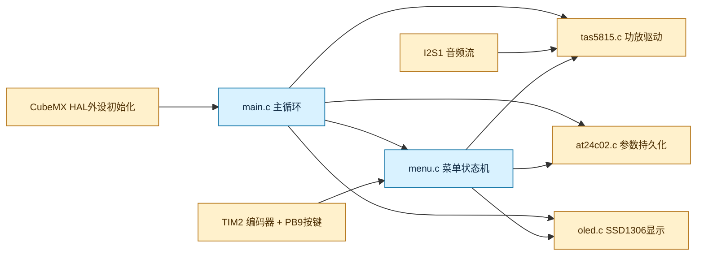
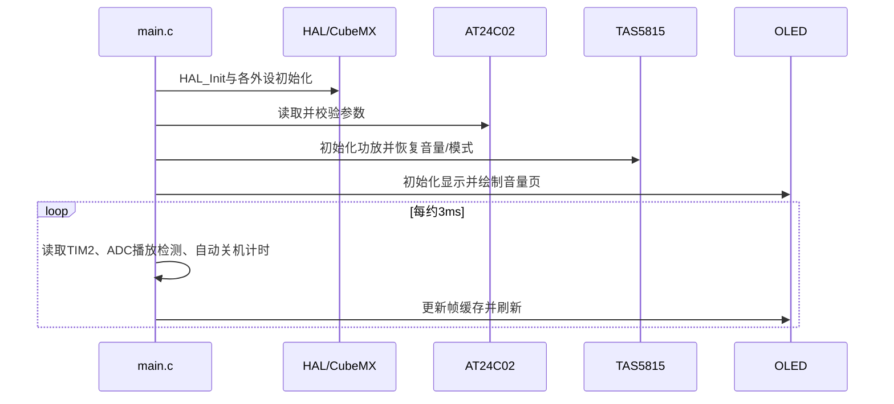
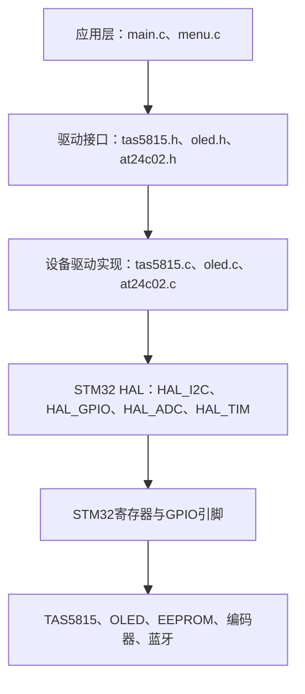
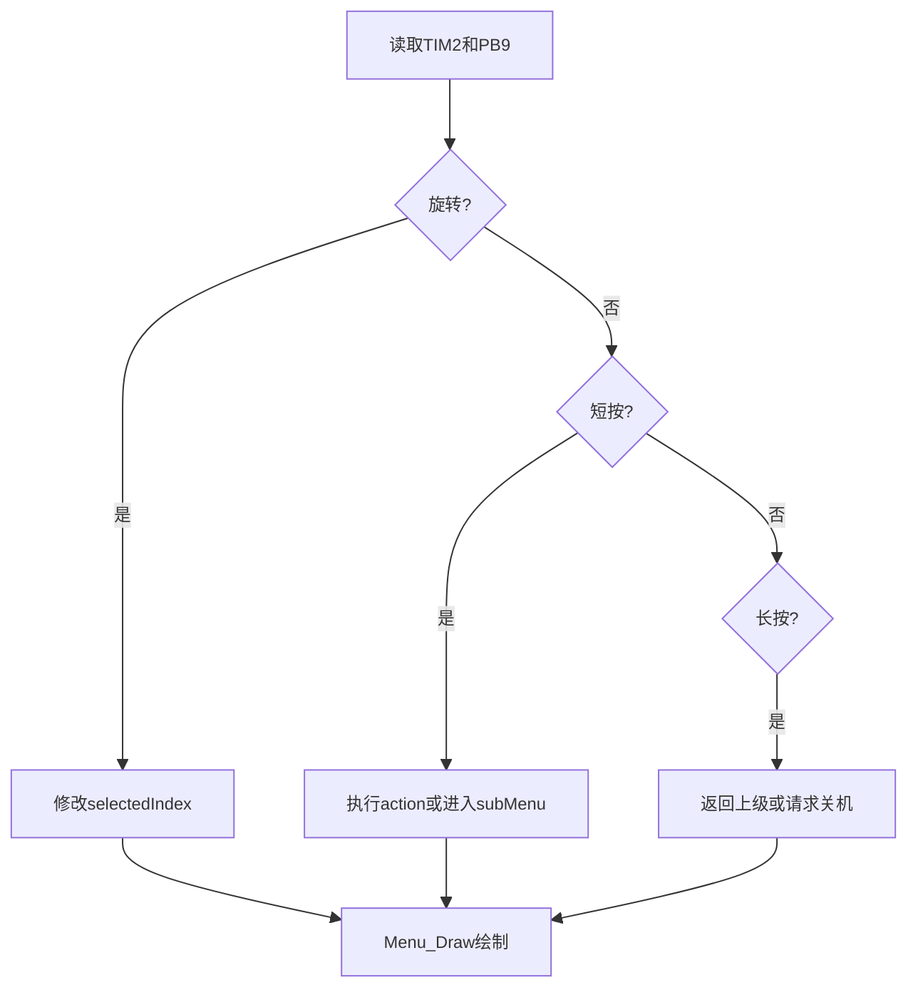

# STM32F411 TAS5815项目学习指南

## 项目定位

这是一个基于 STM32F411CEU6 的裸机音频功放控制器。STM32负责上电时序、TAS5815寄存器配置、编码器菜单、OLED显示、EEPROM参数保存和待机唤醒；音频采样数据通过 I2S1 送入 TAS5815，蓝牙模块负责音源。

## 模块关系



## 文件职责与编写方式

|文件|作者/来源|职责|关键关系|
|---|---|---|---|
|`Core/Src/main.c`|项目应用代码，外壳由CubeMX生成|时钟、外设初始化、主循环、播放检测、自动关机、STOP唤醒|调用所有自研模块|
|`Core/Src/menu.c/.h`|项目应用代码|菜单状态机、编码器和按键解释、OLED菜单绘制|调用功放、EEPROM、OLED接口|
|`Core/Src/tas5815.c/.h`|项目应用代码|I2C1写寄存器、音量/增益/调制/FSW、睡眠唤醒|依赖`hi2c1`|
|`Core/Src/oled.c/.h`|基于SSD1306通用驱动改写|RAM帧缓存、图元、字体输出、I2C刷新|依赖`hi2c3`和`font.c`|
|`Core/Src/at24c02.c/.h`|项目应用代码|EEPROM字节读写与有效标志校验|与OLED共享I2C3，必须串行访问|
|`Core/Src/font.c/.h`|字模资源|ASCII/数字/图像点阵常量|只读，被OLED引用|
|`Core/Src/gpio.c、i2c.c、tim.c、adc.c、i2s.c、spi.c、usart.c、usb_otg.c`|STM32CubeMX生成|HAL句柄、GPIO复用、外设初始化|不要在USER CODE外修改|
|`Core/Src/stm32f4xx_it.c`|CubeMX生成并含少量用户中断逻辑|SysTick、EXTI、DMA/外设中断入口|调用HAL IRQ处理函数|
|`MDK-ARM/stm32f411totas5815.uvprojx`|Keil工程配置|源文件、编译器AC6、目标芯片和输出|构建生成AXF/HEX|

## 上电执行流程



## 必须掌握的硬件映射

|总线/引脚|连接|软件入口|
|---|---|---|
|I2C1 PB6/PB7|TAS5815，7位地址`0x54`|`tas5815_*()`|
|I2C3 PA8/PB8|SSD1306 `0x3C` + AT24C02 `0x50`|`OLED_*()`、`AT24C02_*()`|
|TIM2 PA0/PA1|旋转编码器|`__HAL_TIM_GET_COUNTER()`|
|PB9 EXTI|编码器按键|短按确认，长按返回/关机|
|I2S1 PA5/PA7/PA15|音频时钟、数据、帧同步|HAL I2S外设|
|PA6 ADC6|播放检测，阈值1240|`HAL_ADC_*()`|
|PA9/PB10|PD电压控制|`SetVoltage()`，禁止直接写GPIO|

## 编码器音量算法

TIM2每个音量步产生2个计数，因此应用值为 `volume = counter >> 1`，范围为$0$到$99$。软件设置音量时写入 `counter = volume << 1`。音量变化后等待$2$秒无操作再写EEPROM，避免频繁磨损。

## 学习与修改顺序

先读`main()`理解生命周期，再读`menu.c`掌握状态机；随后分别跟踪`tas5815.c`的I2C寄存器序列、`oled.c`的帧缓存、`at24c02.c`的有效标志。修改CubeMX文件时只放在`USER CODE BEGIN/END`之间。每次修改后使用 `compile_project.ps1` 或 Keil UV4重新构建，先处理编译错误，再用逻辑分析仪检查I2C地址、ACK和写周期。

## 深入理解main.c

`main.c`是应用层的“编排者”，不应承担所有底层细节。启动阶段先调用`HAL_Init()`，建立SysTick和HAL状态；随后`SystemClock_Config()`配置系统时钟，`MX_GPIO_Init()`、`MX_I2C1_Init()`、`MX_I2C3_Init()`、`MX_ADC1_Init()`、`MX_TIM2_Init()`和`MX_I2S1_Init()`分别建立外设句柄。`MX_`函数来自CubeMX，真正的引脚复用和时钟使能在`stm32f4xx_hal_msp.c`中完成。

应用初始化顺序很重要：先让蓝牙和电源处于安全状态，再初始化OLED，显示启动画面；启动TIM2编码器后从EEPROM加载音量、电压、调制、FSW、AMP增益和关机策略；最后调用`tas5815_Initialize()`写入功放寄存器。这样可以避免功放已经输出而参数尚未恢复。

主循环每次执行以下动作：

* `Menu_Process()`轮询编码器和PB9按键。菜单状态不是线程，而是一个静态结构体，保存当前页面、选中索引和子菜单指针。
* `Menu_IsPowerOffPending()`为真时调用`System_PowerOff()`。进入STOP前先把待保存音量写入EEPROM、将PD降到5V、让功放睡眠、关闭OLED，再配置PB9/PB0唤醒。
* 在`MENU_STATE_VOLUME`页面读取TIM2计数器。计数器右移一位得到音量，随后进行$0$到$99$限幅，并调用`set_tas5815_volume()`实时改变功放。
* 使用ADC6连续取样播放信号。任何一次采样超过1240就认为正在播放，并让START状态保持约100ms，避免信号过零时显示闪烁。
* ADC9通过$51\text{k}\Omega/10\text{k}\Omega$分压测量PD电压，换算公式为$V=ADC\times3.3\times6.1/4095$。
* `OLED_NewFrame()`清空RAM画布，绘制完毕后`OLED_ShowFrame()`一次性刷新，最后延时3ms让循环周期保持在毫秒级。

## TAS5815驱动怎样工作

TAS5815是音频数据从I2S进入、控制寄存器从I2C进入的数字功放。`TAS5815_WriteReg()`封装了“寄存器地址+数据”的HAL I2C发送；所有公开函数先选择册页/寄存器，再写入对应值。HAL地址参数必须使用`0x54<<1`，因为HAL接口使用8位地址格式。

音量接口接收应用层的$0$到$99$，函数内部把它转换为芯片需要的衰减码。静音和唤醒分别写功放状态寄存器；模拟增益使用索引$0$到$7$映射到不同dB档位；调制模式和FSW同样使用索引而不是让菜单直接操作寄存器。这样的分层使菜单只表达“用户意图”，寄存器细节集中在驱动中。

## OLED驱动怎样工作

SSD1306显存按8个page组织，每个page包含64列字节。驱动在MCU RAM中维护完整帧缓冲：`OLED_SetPixel()`计算`page=y/8`和位掩码`1<<(y%8)`，图元函数最终都归约为像素或字节操作。字符串函数从`font.c`取得点阵，UTF-8字符串先识别字节长度，再匹配中文字模；ASCII字符使用默认字体。

只有`OLED_ShowFrame()`访问I2C3显示器，因此菜单绘制过程中不会出现半帧。由于I2C3同时连接AT24C02，EEPROM写操作必须在主循环中顺序执行，不能在中断里刷新OLED或保存参数。

## EEPROM保存策略

AT24C02每个设置占用两个字节：数据地址保存值，紧邻地址保存固定有效标志。例如音量位于`0x00`，标志位于`0x01`且值为`0xA5`。上电读取时必须同时检查I2C返回值、标志值和范围；任一失败就使用默认值。写入后器件需要内部写周期，驱动中的延时和ACK轮询用于等待完成。

音量是高频变化量，因此采用“最后一次旋转后等待2秒”的节流策略；电压、调制、FSW、AMP和关机模式属于低频菜单操作，确认后立即保存。STOP前再次刷新待保存音量，避免断电丢失。

## menu.c状态机

`MenuState`描述页面，`MenuItem`描述一行菜单。每个项目可以有`action`函数，也可以有`subMenu`数组。编码器只改变`selectedIndex`，短按执行当前项目：有子菜单则切换数组，没有子菜单则调用动作函数；长按根据当前层级返回上一级，最终回到音量页。菜单绘制限制可见行数，并在当前已保存项目旁绘制小圆点。

蓝牙配对是典型的时序动作：PB12/PB14输出约100ms脉冲控制上一曲/下一曲；配对时PA10先拉低500ms复位，再拉高，PB13保持高电平1s。因为使用`HAL_Delay()`，这些动作只能从主循环调用，不能放入EXTI中断。

## 电源与STOP唤醒

`SetVoltage(0/1/2)`统一控制PA9和PB10：$5\text{V}$为`HIGH/LOW`，$12\text{V}$为`LOW/LOW`，菜单显示的“15V”实际让PD_20V为高，硬件输出约$20\text{V}$。STOP模式前必须先降压并让TAS5815睡眠。唤醒后重新恢复系统时钟、GPIO、OLED和功放状态，并把TIM2计数器同步到当前音量，否则第一次旋转会产生跳变。

## 实际调试方法

先用万用表确认5V/12V/高压档互锁，再用逻辑分析仪观察I2C1地址`A8`、I2C3地址`78`和`A0`（均为8位写地址表现）。OLED无显示时先检查I2C3上拉和`0x3C` ACK；EEPROM不保存时检查写周期和有效标志；音量跳变时观察TIM2计数器是否按两计数一步递增。功放无声时依次确认I2S时钟、TAS5815退出睡眠、取消静音、输入音频和PD供电，按这个顺序比直接修改寄存器更容易定位问题。

## 学习目标与先修知识

完成本手册后，应能独立解释一次上电到出声的完整路径，能够修改一个菜单选项并将其保存到EEPROM，能够用示波器/逻辑分析仪判断I2C和I2S是否正常，并能安全修改CubeMX配置。建议先掌握C语言指针、结构体、枚举、函数指针、位运算和中断基础；硬件方面需要理解GPIO电平、上拉、I2C开漏、ADC分压和I2S时序。

## 工程目录和构建

`Core/Inc`放头文件，`Core/Src`放实现；`Drivers`是STM32 HAL/CMSIS库；`MDK-ARM`保存Keil工程、启动文件和输出文件。打开`MDK-ARM/stm32f411totas5815.uvprojx`后，确认目标为STM32F411CE、编译器为AC6。命令行构建使用Keil UV4：

```text
C:\Keil_v5\UV4\UV4.exe -j0 -b MDK-ARM\stm32f411totas5815.uvprojx
```

修改后首先看编译错误，再看链接错误，最后才做上电测试。CubeMX生成文件只能在`USER CODE BEGIN/END`中添加应用代码；`tas5815.c`、`menu.c`等自研文件没有这个限制。

## 硬件分层学习

### 电源链路

USB-C输入经过PD协商得到5V、12V或高压档。STM32通过PA9和PB10控制PD电源选择，`SetVoltage()`封装了互锁关系。任何切换都应先确认功放静音或处于安全状态，避免升压瞬间产生喇叭冲击声。ADC9采样分压后的电压，仅用于显示和诊断，不用于闭环稳压。

### 蓝牙与音频链路

QCC3034完成蓝牙协议和音频解码；STM32不解析蓝牙数据，只接收I2S数字音频并把控制脚拉高/拉低。I2S的CLK、SD、WS必须满足TAS5815配置的采样率、位宽和左右声道时序。蓝牙配对、上一曲和下一曲是低速GPIO控制，和高速I2S数据完全不同。

### I2C控制链路

I2C1只连接TAS5815，地址为7位`0x54`；I2C3连接SSD1306(`0x3C`)和AT24C02(`0x50`)。同一总线设备靠地址区分，但总线一次只能有一个事务。OLED刷新通常发送数百字节，EEPROM写入还存在内部写周期，因此不要在定时器或EXTI中断中调用这两个驱动。

## 源码阅读路线

### 第一步：从main.c建立时间线

阅读`main()`时先忽略具体寄存器，按调用顺序画出时间线：HAL初始化、时钟、GPIO、总线、显示、编码器、EEPROM恢复、功放初始化、进入循环。然后重点阅读`SetVolume()`、`SetVoltage()`、`System_PowerOff()`三个应用接口，它们分别代表实时控制、电源安全和低功耗边界。

### 第二步：读menu.h再读menu.c

先理解`MenuState`、`MenuItem`、`MenuSystem`三个类型，再看静态菜单数组。菜单项中的`action`是函数指针，`subMenu`是子数组指针；短按执行动作或进入子菜单，长按返回上级。用调试器观察`selectedIndex`、`currentState`和`currentMenu`，比只看OLED画面更容易理解状态机。

### 第三步：读设备驱动

在`tas5815.c`中从`TAS5815_WriteReg()`开始，跟踪一个音量设置如何变成I2C事务；在`at24c02.c`中跟踪“写数据、写标志、等待内部写周期”；在`oled.c`中跟踪“清帧、画像素、发整帧”。每次只跟踪一个公开函数，不要一次阅读全部700行OLED图形代码。

### 第四步：读CubeMX外设文件

`gpio.c`负责引脚初始电平和输入输出模式；`i2c.c`负责速度、地址模式和时钟；`tim.c`把TIM2配置成编码器接口；`adc.c`建立ADC1规则组；`i2s.c`配置音频串行口；`stm32f4xx_hal_msp.c`把外设实例映射到GPIO和时钟。理解这些文件后，就能把业务代码调用和硬件寄存器对应起来。

## 关键实验清单

|实验|修改位置|预期现象|学习重点|
|---|---|---|---|
|点亮OLED启动页|`main.c`启动绘制|上电显示文字|I2C初始化与帧缓存|
|固定音量|`SetVolume(50)`|音量恢复为50|TIM2同步与TAS5815寄存器|
|增加一个菜单项|`menu.c`菜单数组|编码器可选中并确认|结构体和函数指针|
|保存一个参数|调用`AT24C02_SaveByte`|断电重启仍保留|EEPROM写周期和校验|
|改变播放阈值|`PLAY_THRESHOLD_ADC`|START/STOP显示变化|ADC采样和抗抖|
|验证待机唤醒|触发`System_PowerOff()`|PB9或PB0唤醒恢复|STOP模式和时钟恢复|
|观察I2C|逻辑分析仪接SCL/SDA|看到地址、ACK、数据|总线协议排障|

## 常见错误与判断

编译错误通常来自头文件声明不一致、函数参数类型不匹配或CubeMX重新生成覆盖了用户代码；链接错误通常来自同名函数重复定义。运行时OLED黑屏先看供电、上拉、地址和初始化命令；EEPROM读到默认值先看有效标志是否写成功；音量跳变先看计数器是否被菜单退出逻辑同步；功放无声按“PD供电、I2S时钟、退出睡眠、取消静音、输入数据、扬声器连接”顺序排查。

## 面试与项目总结表达

描述项目时应区分控制面和数据面：I2C是功放寄存器控制，I2S是音频数据传输；OLED和EEPROM共享I2C3，需要串行访问；音量采用TIM2硬件编码器并做两计数一档换算；参数通过数据字节加有效标志持久化；STOP唤醒后必须恢复系统时钟和外设状态。不要把“配置了SPI/USB/RTC”写成“实现了完整业务”，当前代码中这些模块主要是初始化或预留。

## 进阶扩展方向

可以将阻塞式I2C改为DMA或状态机，将按键轮询改为事件队列，为EEPROM增加CRC和磨损均衡，为音量保存增加掉电保护，使用定时器输入捕获测量I2S或播放节拍，并为TAS5815寄存器表建立版本化配置。每项扩展都应先写接口和错误处理，再接入菜单，避免把硬件细节散落到应用层。

# 初学者逐文件教程

## 先建立一个正确的认识

这个项目不是“一个C文件控制所有硬件”，而是几个层次合作完成任务：



初学者可以把它理解成餐厅：`main.c`是店长，决定什么时候做什么；`menu.c`是前台，理解用户操作；`tas5815.c`、`oled.c`、`at24c02.c`是厨师，只接受明确订单；HAL是厨房基础设施，负责真正驱动硬件。应用层不应该直接到处写GPIO寄存器，设备驱动也不应该决定菜单显示内容。

## 文件类型先学会区分

|文件类型|作用|初学者重点|
|---|---|---|
|`.h`头文件|告诉其他文件“有哪些类型、变量和函数可以使用”|看结构体、枚举、宏和函数声明|
|`.c`源文件|真正实现函数|看变量、流程和HAL调用|
|CubeMX文件|生成外设初始化代码|理解引脚和句柄，不随意改生成区|
|自研驱动文件|项目开发者编写的功能代码|可以完整阅读、修改和移植|
|启动/库文件|芯片启动、CMSIS和HAL基础设施|先知道作用，不必第一天读完|

例如：`tas5815.h`声明`set_tas5815_volume()`，`tas5815.c`实现它，`main.c`包含头文件后才能调用。编译器先编译各个`.c`，链接器再把函数调用和实现拼成一个程序。

## main.h与main.c

`main.h`是公共入口头文件，通常包含`main.c`需要的HAL头文件、GPIO宏和错误处理声明。它不应该放大量业务实现。`main.c`包含真正的应用生命周期：

```text
main()
  ├─ HAL_Init()
  ├─ SystemClock_Config()
  ├─ MX_GPIO_Init()
  ├─ MX_I2C1_Init()/MX_I2C3_Init()
  ├─ MX_ADC1_Init()/MX_TIM2_Init()/MX_I2S1_Init()
  ├─ OLED_Init()
  ├─ AT24C02_Load*()
  ├─ tas5815_Initialize()
  └─ while(1)
       ├─ Menu_Process()
       ├─ 处理关机
       ├─ 处理编码器音量
       ├─ ADC播放检测
       ├─ OLED_ShowFrame()
       └─ HAL_Delay(3)
```

关键全局数据：`g_volume`保存当前应用音量，`g_currentVoltage`保存当前电压档位，`g_currentModulation`和`g_currentFSW`保存功放状态，`g_lastPlayTime`用于自动关机计时。`g_volumeNeedSave`和`g_volumeChangeTime`实现音量延迟保存。

学习`main.c`的方法是先只画出函数调用树，再逐个进入函数。不要一开始纠结所有HAL参数。需要特别看三类函数：实时控制函数（`SetVolume`）、安全控制函数（`SetVoltage`）、生命周期函数（`System_PowerOff`）。

## CubeMX生成文件

### gpio.c/gpio.h

`MX_GPIO_Init()`设置每个引脚是输入、推挽输出、开漏、复用或外部中断，并设置初始电平。本项目关键引脚包括：PA9/PB10控制PD电压，PA10控制蓝牙使能，PB12/PB13/PB14发蓝牙控制脉冲，PB9是编码器按键，PB0是USB检测，PA6是播放检测输入。

使用方法是：启动时调用`MX_GPIO_Init()`，运行时使用`HAL_GPIO_WritePin()`输出，使用`HAL_GPIO_ReadPin()`读取。不要在业务代码中重复配置同一引脚，否则可能覆盖CubeMX生成的模式。

### i2c.c/i2c.h

该文件生成`I2C_HandleTypeDef hi2c1`和`hi2c3`。句柄不是设备本身，而是STM32外设的软件控制对象。`MX_I2C1_Init()`配置TAS5815总线，`MX_I2C3_Init()`配置OLED和EEPROM共享总线。

移植时必须同时修改：CubeMX中的SCL/SDA引脚、时钟速度、GPIO复用、设备地址和驱动中的句柄。只改引脚而不改驱动句柄，代码可以编译但设备不会响应。

### tim.c/tim.h

TIM2被配置为编码器模式，PA0和PA1接A/B两相信号。`HAL_TIM_Encoder_Start(&htim2, TIM_CHANNEL_ALL)`启动硬件计数。主循环用`__HAL_TIM_GET_COUNTER(&htim2)`读取位置。

本项目每两个硬件计数代表一个音量等级，因此使用：

$$\text{volume}=\text{counter}>>1$$

移植到不同编码器时，需要重新确认计数方向、每圈脉冲数、输入滤波和是否需要四倍频。

### adc.c/adc.h

ADC1没有一直后台运行，而是由`Read_ADC_Channel()`动态选择通道、启动转换、等待完成、读取12位结果、停止转换。ADC6用于播放检测，ADC9用于电压测量。

ADC值不是电压值。理想情况下：

$$V_{pin}=ADC\times3.3/4095$$

对于电阻分压，还要乘以分压比例。本项目使用约$6.1$倍换算。换板子时必须重新计算分压比，否则OLED显示电压会错误。

### i2s.c/i2s.h

I2S是音频数据接口，不是普通I2C。PA5输出时钟，PA7传输串行音频数据，PA15输出字选择/帧同步。QCC3034负责产生音频，STM32的I2S外设把数据送往TAS5815。

当前代码主要完成外设配置；如果要实现连续音频搬运，通常还需要DMA和`HAL_I2S_Transmit_DMA()`或接收DMA。移植时必须匹配采样率、数据宽度、标准格式、主从模式和左右声道时序。

### spi.c、usart.c、usb_otg.c

这些文件主要是CubeMX生成的外设初始化。SPI3当前没有参与业务；USART2用于调试扩展；USB OTG完成外设配置，但PB0 USB检测是独立GPIO输入。学习重点是认识“配置存在”不等于“业务已经实现”。

### stm32f4xx_hal_msp.c

MSP是HAL底层资源层，负责打开外设时钟、配置GPIO复用、配置DMA和中断。`MX_I2C1_Init()`最终会间接调用`HAL_I2C_MspInit()`。移植外设时，CubeMX通常自动修改此文件；手工修改必须了解时钟和复用映射。

### stm32f4xx_it.c

这是中断入口文件。它把CPU中断向量转给HAL，例如SysTick进入`HAL_IncTick()`，EXTI进入`HAL_GPIO_EXTI_IRQHandler()`。中断服务函数应该短小，不能调用OLED刷新、EEPROM写入、`HAL_Delay()`等阻塞操作。

## 自研设备驱动

### tas5815.h/tas5815.c

头文件向应用提供逻辑接口：初始化、音量、静音、模拟增益、调制、FSW、睡眠和唤醒。应用只传入音量等级或索引，寄存器页、寄存器地址和位域由驱动内部处理。

核心函数关系：

```text
set_tas5815_volume(count)
  └─ 计算芯片衰减码
     └─ TAS5815_WriteReg(reg, value)
        └─ HAL_I2C_Mem_Write(&hi2c1, 0x54 << 1, ...)
```

移植到另一块MCU时，需要替换HAL发送函数、I2C句柄、延时函数和GPIO复位脚；芯片寄存器表不能凭经验修改，必须以TAS5815数据手册为准。调试时先确认I2C地址ACK，再确认寄存器写入，最后确认功放输出。

### oled.h/oled.c

OLED驱动分为三层：底层发送命令/数据，中层操作RAM帧缓冲，高层绘制文字和图形。`OLED_NewFrame()`清空缓存，`OLED_SetPixel()`改一个像素，`OLED_DrawRectangle()`等函数组合像素，`OLED_PrintString()`使用字体点阵，`OLED_ShowFrame()`把整帧通过I2C3发送。

这种“双缓冲”方式的好处是屏幕不会看到半个菜单。移植时需要修改屏幕地址、分辨率、页数、初始化命令和I2C句柄；如果屏幕是SH1106，列偏移和初始化序列通常不同，不能只改设备地址。

### font.h/font.c

字体文件不是程序逻辑，而是常量点阵资源。`ASCIIFont`描述ASCII字体高度、宽度和连续字模；`Font`描述UTF-8或中文字体。OLED只读取这些数组，不应在运行时修改。

更换字体时要同时保证：数组长度正确、每个字符宽高元数据正确、编码索引一致、Flash占用可接受。字体资源很大，是嵌入式项目中常见的ROM占用来源。

### at24c02.h/at24c02.c

AT24C02是256字节I2C EEPROM。驱动底层函数是`AT24C02_ReadByte()`和`AT24C02_WriteByte()`；上层函数把具体配置映射到固定地址。写入一个设置时通常先写值，再写有效标志；读取时同时检查标志和范围。

移植时需要修改I2C句柄、设备地址、写周期等待方式和页面边界。AT24C02页写不能跨页，单字节写最容易理解但速度较慢。必须避免在高频循环中反复写同一地址，否则会加速器件磨损。

## menu.h/menu.c

菜单是本项目最适合学习C语言高级特性的模块。`MenuState`是枚举，描述当前页面；`MenuItem`包含字符串、目标状态、动作函数指针和子菜单指针；`MenuSystem`保存运行时状态。

一个菜单项可以这样理解：

```c
{"电压设置", MENU_STATE_VOLTAGE, NULL, voltageMenu, 4}
```

含义是显示“电压设置”，确认后进入`MENU_STATE_VOLTAGE`，它没有直接动作，但拥有4项子菜单。另一个动作项可能是：

```c
{"12V", MENU_STATE_VOLTAGE, Voltage_Set12V, NULL, 0}
```

确认后调用`Voltage_Set12V()`，该函数同时调用`SetVoltage(1)`和`AT24C02_SaveVoltage(1)`。

菜单处理流程为：



移植菜单到别的项目时，先保留`MenuItem`模型，再替换输入事件、显示函数和动作函数。不要把具体GPIO操作直接写在绘制函数中；绘制负责显示，动作负责改变硬件。

## 一次完整功能的跟踪示例

以“旋转编码器把音量从30调到31”为例：TIM2硬件计数从60变化到62，`main.c`读取计数并右移一位得到31；程序发现音量变化，调用`set_tas5815_volume(31)`通过I2C1写功放寄存器，同时更新OLED数字和进度条；记录`g_volumeChangeTime`，2秒内继续旋转只更新内存和功放，停止2秒后调用`AT24C02_SaveVolume(31)`写入I2C3 EEPROM。这个例子同时串起了TIM2、main、TAS5815、OLED和EEPROM五个模块。

## 如何从零移植这个项目

第一步，创建目标MCU的CubeMX工程，配置系统时钟、GPIO、I2C、I2S、ADC和TIM。第二步，确认新板的每个引脚和本项目不同之处，建立一张引脚映射表。第三步，复制`.h/.c`自研驱动，但先只编译，不接菜单。第四步，单独测试I2C扫描、OLED显示、EEPROM读写和TAS5815单寄存器写入。第五步，加入TIM2编码器和音量控制。第六步，加入菜单、蓝牙控制和自动关机。最后再启用STOP低功耗，因为低功耗会改变时钟、GPIO和唤醒配置。

每移植一个外设都要回答四个问题：这个外设的句柄叫什么？使用哪些引脚？由哪个`MX_`函数初始化？业务代码从哪个公开函数调用？如果这四个问题答不上来，就不要继续复制代码。

## 初学者每日学习计划

第一阶段阅读C语言类型、指针、结构体、枚举和函数指针，并能解释`MenuItem`。第二阶段只看CubeMX生成的GPIO、I2C、TIM、ADC初始化，画出引脚表。第三阶段跟踪音量完整链路并用调试器观察变量。第四阶段阅读EEPROM和OLED，完成“保存一个新参数”和“显示一行新文字”。第五阶段阅读STOP模式和中断，使用逻辑分析仪验证I2C。每完成一个阶段都要编译、下载、记录现象和结论。


