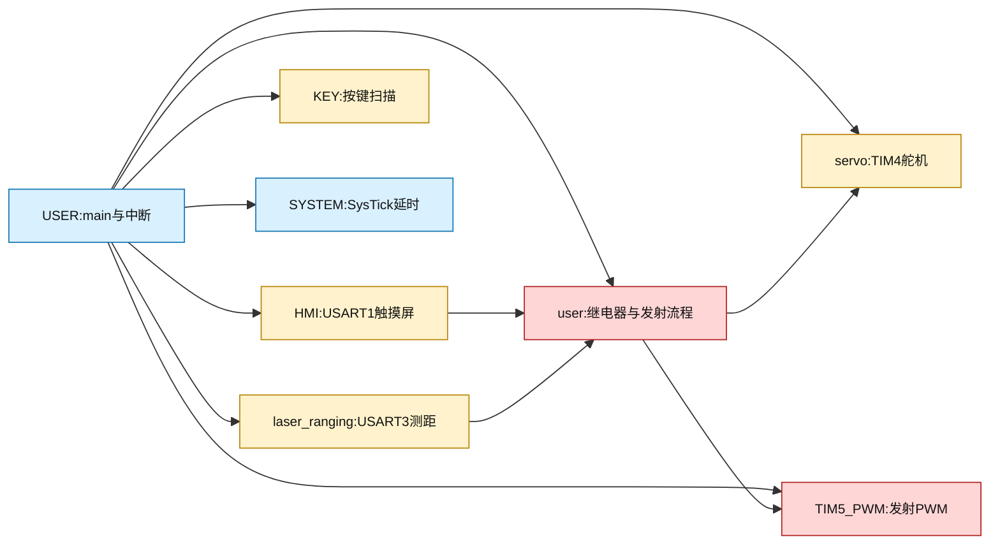
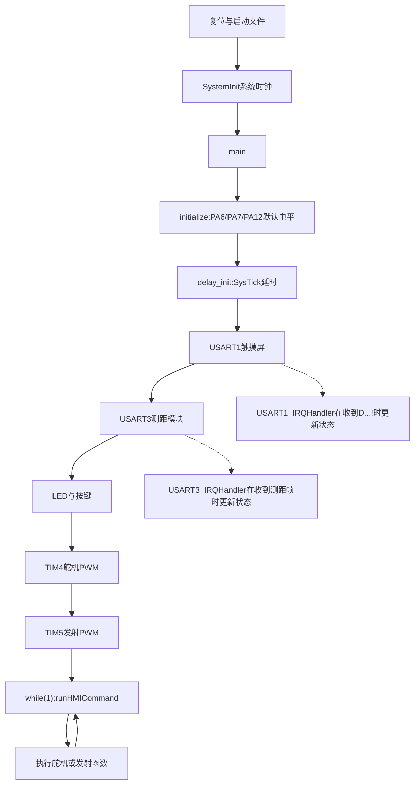
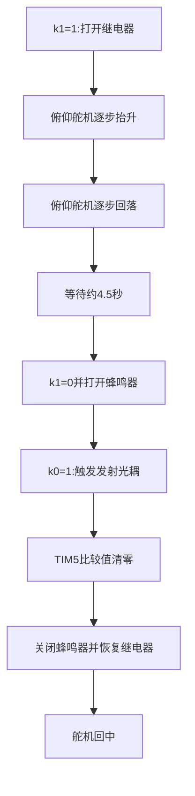

# STM32电磁曲线炮项目说明

> **资料边界**：硬件背景参考用户提供的立创项目离线网页；程序行为以`USER/USART.uvprojx`实际编译输入和源码为准。网页中的BOM、项目介绍不能替代原理图、PCB实物和芯片手册。

> **当前工程状态**：Keil构建已通过，结果为`0 Error(s), 1 Warning(s)`。唯一警告来自`HARDWARE/user/user.c`中`tance_3()`的未使用局部变量`pwm`，不是本次注释造成的错误。

## 快速认识项目

这是一个以STM32F1为主控的二维云台电磁炮演示系统。主控板负责通信、舵机定位、测距判断和发射控制；斩波升压、高压储能、电磁线圈及其功率开关属于外围功率硬件，当前C程序只通过GPIO和PWM发出控制信号。

|层级|主要硬件|作用|
|---|---|---|
|控制层|STM32F103系列|执行控制逻辑和协议解析|
|交互层|串口触摸屏|输入角度、距离、扫描参数和发射命令|
|感知层|激光测距模块|返回目标距离|
|执行层|俯仰/水平舵机|调整炮管方向|
|功率层|升压、储能电容、功率开关、线圈|完成电能到机械运动的转换|
|辅助层|继电器、光耦、蜂鸣器、LED、按键|隔离、提示、调试和备用控制|

## 安全边界

⚠️ 高压储能电容断电后仍可能带电。调试时必须先使用合适的放电方案确认电压为零，再接触功率板。

- 先用串口工具、示波器、LED或假负载验证控制板。
- 未确认继电器和光耦默认状态前，不要连接高压电源和线圈。
- STM32的GPIO不能直接驱动线圈，必须经过隔离和功率驱动级。
- 本文没有验证弹丸、射程、能量、距离精度或功率级安全性。

## 工程文件关系



|目录或文件|实际职责|
|---|---|
|`USER/main.c`|初始化所有模块，主循环调用`runHMICommand()`|
|`HARDWARE/HMI`|USART1触摸屏接收、命令解析和屏幕发送|
|`HARDWARE/laser_ranging`|USART3测距帧接收和厘米值解析|
|`HARDWARE/servo`|TIM4 CH3/CH4舵机PWM|
|`HARDWARE/TIM5_PWM`|TIM5 CH2发射PWM|
|`HARDWARE/user`|PA6、PA7、PA12及手动/自动发射流程|
|`HARDWARE/KEY`|PD8~PD11按键初始化和扫描；当前主循环未调用|
|`SYSTEM`|SysTick延时和底层系统辅助函数|
|`STM32F10x_FWLib`|STM32标准外设库|

## 硬件连接表

### 通信接口

|功能|外设|STM32引脚|参数或协议|
|---|---|---|---|
|触摸屏TX|USART1_RX|`PA10`|`115200,8-N-1`|
|触摸屏RX|USART1_TX|`PA9`|`115200,8-N-1`|
|测距模块TX|USART3_RX|`PB11`|`115200,8-N-1`|
|测距模块RX|USART3_TX|`PB10`|当前代码只明确使用接收帧|

USART1触摸屏帧格式为：

```text
D + 命令 + 参数 + !
```

USART3测距模块期望的帧格式为：

```text
D=3.30m
```

其中`ranging()`把米转换为厘米后返回整数`330`。

### 舵机、PWM和提示输出

|功能|外设或GPIO|引脚|说明|
|---|---|---|---|
|俯仰舵机|TIM4 CH3|`PB8`|`servo(3,b)`|
|水平舵机|TIM4 CH4|`PB9`|`servo(4,b)`|
|发射PWM|TIM5 CH2|`PA1`|比较值由`TIM_SetCompare2()`修改|
|发射光耦|GPIO|`PA6`|宏`k0`|
|继电器|GPIO|`PA7`|宏`k1`|
|蜂鸣器|GPIO|`PA12`|低电平有效宏定义|
|LED0/LED1|GPIO|`PB0/PB1`|以实际初始化代码为准|
|KEY0~KEY3|GPIO输入|`PD8~PD11`|上拉输入、低电平按下|

代码中的高低电平只表示STM32端的电平，不代表继电器、光耦或功率开关一定是高电平有效；最终有效电平必须结合外围驱动电路确认。

## 定时器计算

### TIM4舵机PWM

当前调用：

```c
TIM4_PWM_Init(19999, 71);
```

在定时器输入时钟为72MHz且APB1定时器倍频生效的常见配置下：

$$f_{counter}=\frac{72MHz}{71+1}=1MHz$$

因此每个计数约为$1\ \mu s$，自动重装值$19999$对应约$20\ ms$周期。舵机比较值通常在约$1000\sim2000\ \mu s$范围内，但本项目的零点和角度斜率是机械标定参数，不能直接套用到其他舵机。

### TIM5发射PWM

当前调用：

```c
TIM5_PWM_Init(999, 71);
```

代码意图是把TIM5计数分辨率设置为约$1\ \mu s$，周期约$1\ ms$，再用CH2比较值改变输出脉宽。

需要重点核对两点：

- TIM5属于APB1，原代码却调用了`RCC_APB2PeriphClockCmd(RCC_APB1Periph_TIM5, ENABLE)`；这是原程序的硬件配置疑点，本次只在文档中标注，没有修改源代码。
- `TIM_CtrlPWMOutputs()`主要用于高级定时器的主输出使能，TIM5是否需要该调用应以STM32F1参考手册、标准外设库实现和实测PA1波形为准。

## 程序启动和信号流



主循环是轮询式的，但两个串口接收使用中断。发射和自动扫描函数内部大量使用`delay_ms()`，因此执行期间主循环无法及时处理新的触摸屏命令；串口中断仍可能继续接收数据。

## 触摸屏命令

|命令示例|实际调用|作用|
|---|---|---|
|`D3,10!`|`servo(3,10)`|俯仰控制|
|`D4,-20!`|`servo(4,-20)`|水平控制|
|`D2,0!`|`servo(2,0)`|舵机回中|
|`DA!`|`shoot()`|固定流程发射|
|`DP,50!`|比较值`500`|直接设置TIM5比较值|
|`DB,100!`|`tance_1(100)`|按距离计算PWM后发射|
|`DC,100R-15!`|`tance_2(100,-15)`|按距离和角度发射|
|`DE,1!`或`DE,2!`|`tance_3()`|自动扫描寻靶|
|`DF,330!`|设置`flage=330`|设置距离阈值，单位厘米|
|`DG,30!`|设置`fan=30`|设置扫描范围参数|
|`DH,5!`|设置`tit=5`|设置距离补偿参数|

当前协议是简单单帧协议，存在以下限制：缓冲区仅20字节，没有校验和、超时和完整的长度保护；触摸屏必须发送合法且长度受限的帧。

## 三条发射路径

### 固定流程

`shoot()`的源码时序为：



其中`k0`和`k1`只是GPIO宏，实际“打开/关闭”含义必须结合外围晶体管、继电器线圈和光耦输入级确认。

### 指定距离和角度

`tance_1()`和`tance_2()`使用项目经验公式计算TIM5比较值。该公式依赖当前炮体、供电、线圈、弹丸和机械结构，换硬件后必须重新标定，不能视为通用抛射模型。

### 自动寻靶

`tance_3()`让水平舵机在`±fan`范围内扫描，并在测距值跨过`flage`阈值时记录两侧角度：

```c
目标角度 = (ang1 + ang2) / 2 + bu;
```

随后舵机转向计算结果，再执行发射。该算法假设目标边界能够被激光测距模块稳定检测；没有测距帧、通信超时或异常距离时，当前流程缺少完整的故障退出机制。

## 网页资料与当前工程的差异

用户提供的离线网页介绍了STM32主控、触摸屏、二维舵机云台、斩波升压、大电容储能和激光测距，并列出了硬件附件和BOM。

需要区分以下两类事实：

|来源|可以确认的内容|不能仅凭该来源确认的内容|
|---|---|---|
|网页/BOM|项目定位、部分器件型号、附件和硬件介绍|当前焊接板的实际走线、有效电平、功率器件安全工作点|
|`USART.uvprojx`|编译目标、源码文件和工程组织|网页中的完整功率原理图|
|C源码|GPIO、定时器、协议、软件时序|继电器触点连接、高压电容真实电压和线圈参数|
|实物/仪器|实际电平、波形、电流、温升和动作|仅靠源码无法替代的硬件结果|

网页BOM中出现`STM32F103C8T6`，而当前Keil工程配置为`STM32F103VC`。这是必须在硬件实物、工程配置和芯片丝印之间确认的型号差异。

## 已知源码问题清单

- `TIM4_PWM_Init()`实际使用TIM4 CH3/CH4和PB8/PB9，但函数内部保留了TIM3历史注释。
- `LED_Init()`实际配置PB0/PB1，但头文件注释仍写着PB5/PE5。
- `TIM5_PWM_Init()`的TIM5时钟使能调用使用了APB2接口，应在下载前结合芯片手册和PA1波形复核。
- `TIM_CtrlPWMOutputs()`对TIM5是否必要需要进一步确认。
- `laser_ranging.h`声明了`runUSART3Command()`，当前源码没有实现，也没有被调用。
- `KEY_Scan()`已经实现，但`main()`没有调用；当前主要控制入口是触摸屏。
- 接收缓冲区没有完整的越界、校验和、超时处理。
- `tance_3()`中存在未使用变量`pwm`，当前Keil构建因此产生1个警告。

## 验证记录

|验证层级|结果|
|---|---|
|文档与源码交叉核对|已完成|
|GBK源文件编码保护|已完成|
|Keil编译与链接|通过，0错误、1警告|
|USART实测|未执行|
|TIM4/TIM5波形实测|未执行|
|继电器、光耦、功率板低压验证|未执行|
|高压储能、线圈和实机发射|未执行|

后续应先完成串口和PWM低压验证，再在有明确放电、限流、保险和防护措施的条件下验证功率级。
